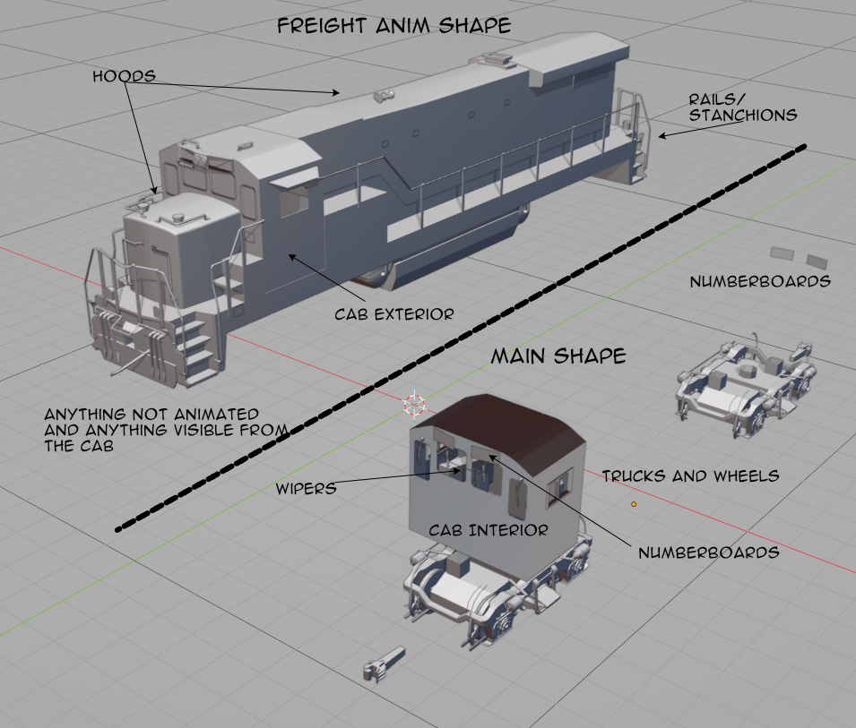
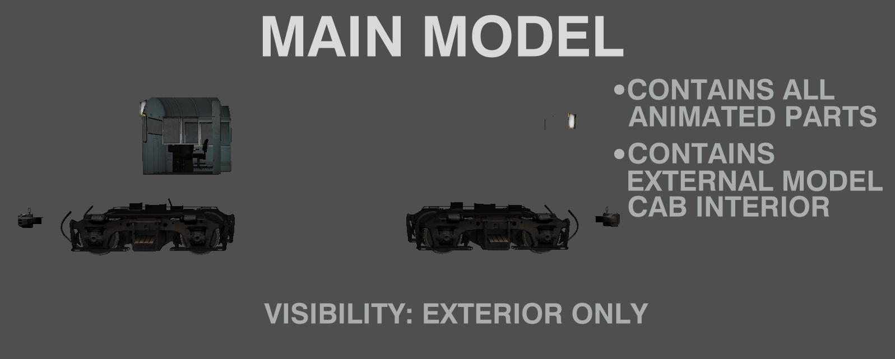
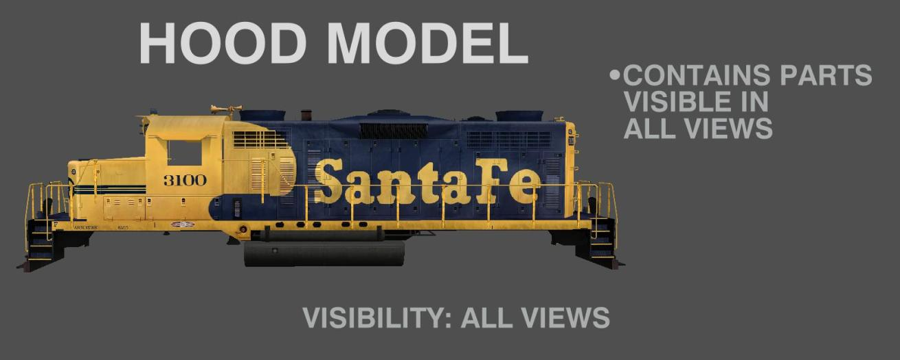
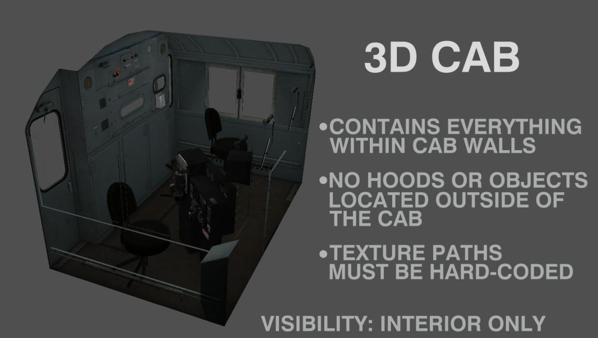
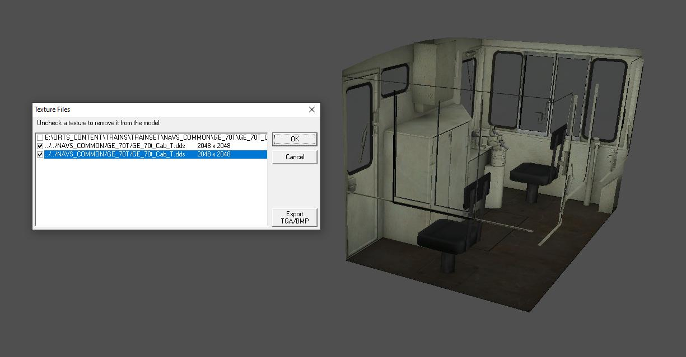

== Creating 3D Cabs

=== Planning Ahead 
(Eric Cantu)

Here's the secret sauce to making a locomotive compatible with a 3D cab, whether it's your own cab or a hypothetical future one. The problem with using a standalone 3D cab model is any locomotive you build, unless it's one of those Soviet or British units with a flat face and no nose, is going to have parts of the body visible out the cab windows, even an F-unit will have the nose visible. Think of all the rails, stanchions, and grabs you can see from the cab. You could include all this stuff in your cab, but then you need a separate cab for each and every individual locomotive that's the same but for the textures. This is, in a word, a really dumb way to do things.

The thing is that Open Rails has, for quite some time, supported visibility parameters for freight shapes that allow you to control when a model is visible. This means that, if you design your locomotive right, you can include everything that will be visible from the cab in the freight shape. This, obviously, excludes anything animated, but most of the animated parts aren't going to be visible from the cab anyway. You can then build a single 3D cab model, place it in a common folder, edit the shape file to hard-code the texture paths, and use a single cab for many locomotives. Here's a quick-and-dirty sketch of a B23-7 that shows how a model should be set up:

Notice that anything that might interfere with the 3D cab goes in the main model, along with the animated parts (note that I animate my numberboards, bell clappers, and cab windows on my current models, so they're included here in this drawing). The main thing you don't want in your freight shape is the external model's cab interior. This is going to step on your 3D cab, so obviously it should go in the main model where it won't be visible from interior views.

Now, look at the freight shape. Notice that anything visible from the cab interior (I included the cab exterior shell because this often interfaces with the interior in a way where the edges of things like gaskets and window ledges will be visible from the windows) is in this model. For this model, you set the visibility parameters such that the model is visible in both interior and exterior views. Here's an example from the 70-tonner:

   ORTSFreightAnims (
        MSTSFreightAnimEnabled ( 0 )
        FreightAnimStatic (
            Shape( ../NAVS_COMMON/GE_70T/GE_70T_Carbody_1.s )
            Visibility ( "Outside,Cab3D" )
            Offset( 0.000, 0.000, 0.000 )
            FreightWeight( 0lb )
        )
        FreightAnimStatic (
            Shape( ../NAVS_COMMON/GE_70T/GE_70T_Figures_1.s )
            Visibility ( "Outside" )
            Offset( 0.000, 0.000, 0.000 )
            FreightWeight( 0lb )
        )
        FreightAnimStatic (
            Shape( ../NAVS_COMMON/GE_70T/Horn_Single_Chime_1.s )
            Visibility ( "Outside,Cab3D" )
            Offset( 0.000, 4.140, 3.264 )
            FreightWeight( 0lb )
        )
        FreightAnimStatic (
            Shape( ../NAVS_COMMON/GE_70T/Decals/GE_70T_Decal_1.s )
            Visibility ( "Outside,Cab3D" )
            Offset( 0.000, 0.000, 0.000 )
            FreightWeight( 0lb )
        )
    )

Notice these models all have their visibility set to outside and cab3D. These will show up in the 3D cab.

[TIP]
The 3D cab should have nothing in it but the cab walls and everything within them, or you won't be able to use the same cab with multiple locomotives. Anything visible outside the 3D cab should be placed as a freight shape visible in both external and internal views. Here's a practical example with the GP20 from the CTN test stock I made for the track audio project:

If you attempt to load a 3D cab from a remote folder, OR will, by default, look for the textures in the nonexistent `cabview3D` folder of the locomotive calling it. Thus, to ensure the cab textures load properly, the paths must be hard-coded by decompressing the shape, searching for "images," and adding an appropriate path. {ORTS} will start two levels down from the `TRAINSET` folder by default, since it expects textures in the locomotive's `Cabview3D` folder (which a locomotive calling a remote 3D cab will not have), so we must first tell it to go up two levels. Here's an example texture path from the 70-tonner cab:

`../../NAVS_COMMON/GE_70T/GE_70T_Cab_T.dds0`

And, to go with that example, here is one of the two 70-ton cab options along with the textures dialog showing the hard-coded paths. You can call this cab from any locomotive and the cab textures will load from the folder the shape and CVF are physically located in.

