== Bitmap Editing

This section is about creating textures that will be applied to your 3d models. Its not about how good you are at it.  Being good at textures takes time and practice, just like 3D modeling.

[NOTE]
In an attempt to be remain bitmap tool agnostic, no particular tools will recommended or favored.  Most options available have very similar capabilities,  though some are just easier to use than others.

=== Layered Format Files

A feature of any proper bit map tool that is to be used with creating textures for our models is the ability to save files that retain isolated working layers.  A bitmap tool that does not understand the concept of working with layered overlay modes is practically useless as you will want to be able to add weathering and decals to a base texture and control opacity values of layers.  To recommend a few tools and formats, the following list should be a guide on what you can use:

|===
| Tool                  | File Type |   Comment

| Affinity Designer     | .afdesign |   Proprietary, Native
| Affinity Designer     | .psd      |   An Import/Export Option
| Affinity Designer     | .tiff     |   An Import/Export Option
| Gimp                  | .xcf      |   Native
| Gimp                  | .psd      |   An Import/Export Option
| Gimp                  | .ora      |   An Import/Export Option (plugin)
| Krita                 | .krt      |   Native
| Krita                 | .ora      |   An Import/Export option
| Paint.Net             | .pdn      |   Native
| Paint.Net             | .psd      |   An Import/Export Option
| Paint.Net             | .ora      |   An Import/Export Option (plugin)
| PaintShopPro          | .psp      |   Proprietary, Native
| PaintShopPro          | .psd      |   An Import/Export Option
|===

* All of the above programs support the `PNG` image export format
* Some of the above support `DDS` image format, eg. Paint.Net and GIMP through the use of external plug-ins
* The `PSD` format was originally a proprietary format used by PhotoShop and some software has trouble opening all `PSD` format variations seen in the wild
* `TIFF` is also a layered format, though not as common and in some cases prone to some tools not fully understanding file contents. Testing needed.
* Open Raster, `ORA`, is a newer file format that is supposed to replace `PSD` as a standard solution for exchanging layered images between graphics editors. It's still not widely used.

[WARNING]
'DDS' files use 'lossy' compression which means that you will lose detail and color information compared to your original texture.

Simple Tools like the native Paint options in Windows are not a good choice for creating textures for 3D Models.

[NOTE]
While the list of tools is not a complete list of available software that supports layers, these are likely the most common.  I have not included the obvious package named "Adobe PhotoShop" in the list.  Adobe PhotoShop still uses the PSD format for its own files. If you own it (or rent it) then it will do the job.  I no longer use this product so I can't determine which import/export file format options are available.  I assume it can support PNG and DDS file formats as well.

In summary, choose a tool that has a native layered file format that can also support PNG and possibly DDS.  For maximum compatibility, choose a free tool, like GIMP or Paint.net, otherwise, save your master documents in `PSD` or `ORA` format

=== Using DDS Textures

DDS is the file extension used to denote the Microsoft DirectDraw Surface (.dds) texture file format. The Microsoft DirectDraw Surface (.dds) file format stores textures and cubic environment maps, with or without mipmaps. It was introduced with DirectX 7.0. Although the format is not natively supported by most graphic editing applications, there are a number of Tools designed to handle the format.

Using `.DDS` textures for your materials has the advantage of reducing the memory usage of textures by slightly decreasing their quality. This is helpful if you have a limited amount of graphics card and system memory and want to include as many textures as possible. Additionally, this method is particularly suitable for organic/nature textures where precision is not critical.

[CAUTION]
It is advised that you always have a MASTER document saved in a native bitmap format since the `DDS` format is a LOSSY document format so you will potentially loose image quality with every edit session of a DDS file.  The advice is to NEVER edit a DDS file and always work from a lossless master.  If the creator of content only supplies a DDS file with their release, you should ask them for a master file, or only use the supplied file to generate a working master you can use to work from so you have minimal degradation.

For working with DDS, the easiest approach is to utilize Paint.net or GIMP as both can export DDS textures directly. However, working with ACE files has become challenging since it is no longer possible to obtain a commercial license for AceIt. Furthermore, exporting large 32-bit ACE textures using the original MSTS tools is not feasible. The most significant advantage of using GIMP or Paint.net is that exporting is much more straightforward and faster compared to outdated programs like TgaTool2.

DDS is a useful format but many of the export options are not suitable for best performance.  

The short explanation is:

1. Always use DXT1 compression with full MIPs, except...

2. DXT5 compression is OK only when you need alpha translucency ( ie alpha values other than on/off )

One of the most significant performance issues with current GPUs is related to the texture size. All textures used on loaded tiles in a scene must fit into the GPU at once. Although modern GPUs have 2G, 4G or more, adding up the texture file sizes for all buildings, terrain, and rolling stock will quickly reveal that the GPU's capacity can be reached. This is especially true when using 2K and 4K textures. When the GPU reaches its limit, performance suffers because additional textures must be swapped out to the CPU every frame.

So maximum compression is the key to good performance. Just compare the size of uncompressed textures and you will see how bloated they are.

|===
|    TYPE           | USAGE                            | Comment
|    DXT1 no alpha  | Textures without transparency    | Normal maps without shine, All glow maps
|    DXT3           | Menu icons / UI elements         | No mipmaps but has transparency
|    DXT5           | Textures with transparency       | Mip Maps and Normal maps with shine (if we ever get that ability)
|===

An alpha channel increases the file size so it should be left out unless it is needed. On color maps, the alpha channel is used for transparency, on normal maps for glossiness. If the texture has no transparency or the normal map has no glossiness saving them as DXT1 (no alpha) instead of DXT5 instantly saves on the file size for no loss. 

You know how sometimes people report that their icons or textures become a rainbow pixel mess? That is related to gimp saving no mipmap textures wrong - it writes in the header that the image has 1 mipmap, but it has none and the game gets confused. I never used gimp and I can't find where I read about this right now, if I'll do, I'll update this post.

[WARNING]
When export compressed DDS files to the game, don't use them for editing. Ensure you are keeping uncompressed versions of the source files that you can load for editing so you don't accumulate compression artifacts.

With GIMP, you would use `export as` and then chose `select file type` and set the options for DDS such as Compression, MIPMAP, etc. Latest versions if GIMP seem to come with DDS support so no plugin is needed.

With Paint.net versions newer than 4.2.2, DDS support comes bundled with the program. You would use the `save as` option and `save as type > DDS`. In the Save Settings window, you would select DXT1 and under Error Metric, check Generate Mip Maps and use Best Quality.

=== Preparing a texture

.When creating textures. remember
[quote, Erick Cantu]
Texture mapping needs to be intuitive and functional.

Probably the best way to start a texture file is to create a background layer that contains the primary colors of your final model.  If your base model is primarily "Tuscan Red", then fill your background with "Tuscan Red".  Variants for Pennsylvania, for example, would be RED rgb(121,68,59), BROWN rgb(111,78,55), TAN rgb(166,123,91).  Many tools allow you to enter a RGB color value into your editor.

You don't need to complete your texture before you apply it to your 3D Model.  Even using the single base color would be OK.

For texture size, consider working with 2048x2048 textures.  Try to avoid creating multiple smaller texture files versus one large file.  You can always shrink your texture to 1024x1024 when all your work is done as the coordinate mapping will remain relative as long as the proportions remain the same.  You could not, however, adjust 2048x2048 to 2048x1024 though, keep that in mind.

If your model is wide but not tall, as many vehicle models are, then you might consider starting with a 2048x1024 texture size, provided that you are only creating content for Open Rails.  Open Rails will not have issues with textures that are not square, unlike {msts}.  

Once you have created your base texture for your model, you should a) Save it in the native format of your editor or in one of the Layered formats like `PSD` or `ORA`. b) Save a copy in `PNG` format for use with Blender.  Copy the `PNG` file to your project folder for your current model so it is easily available during a Blender working session.

Keep in mind that some people who might consider repainting your model will want to make use of their own photographs of actual vehicles or buildings.  This means that it would be "unkind" to these "re-skinners" if you were to  split up the sides of your model into multiple sections as they would have difficulty getting the sections to rejoin cleanly.  Keep the side and top views as continuous shapes in your model and your textures.

=== Coding alternative

For the more software minded, Python 3 can be used to layout your textures using a Python package named PILLOW, (PIL for short).  Now this won't be a guide for using Python or Pillow, but I will share how I have been able to layout sections of a texture to create absolute placement and sizes for UV coordinates using code.

[source,python]
----

----

I have also been able to automate the creation of various number styles with Alpha channel backgrounds.  This technique utilizes TTF fonts to create each number as a 64x64 image that can be called as a separate decal.  While not super efficient, it could allow for widely varying car numbers without too much effort. For USA, this method would rely on 6 separate decals and extra number slots would need a blank 64x64 alpha image.

Using this method is still in the experimental stage for me... but it is something I'm looking forward to making a standard technique I employ

[source,python]
----

----

=== Layering Basics

When working on a texture for a model, you are going to want to add bitmap layers that help to achieve the desired final result.  This means being able to adjust the parameters and effects that each layer brings to the final result.  These include making layers with more opacity so the details of lower layers are not obscured, or adding upper layers that contain effects for Grime, Rust, Dirt, Dust, as explained in the now lost "Painting Guide" that once existed on the 3DTrains.com website.  

[NOTE]
Since the 3DTrains website is now off the Internet, some of the things that I learned from that website will be shared here.  Hopefully Mark doesn't mind that I've tried to share that information here as a sort of archive of what was at the website.

Mark had explained that you would add four NEW layers to your base image and name them Grime, Rust, Dirt and Dust. 

==== Grime Layer

* Set the airbrush tool to a width between 150 and 200
* Select a black color, lets say RGB 10,10,10, for example
* Spray all over the layer making sure it looks uneven and spotty
* Now *hide* this layer from view

==== Rust Layer

* With the same airbrush settings, choose a rust color like RGB 136,57,4
* Make sure its sprayed on so you can still see through it.
* Now *hide* this layer from view

==== Dirt Layer

* With the same airbrush settings, choose a yellowish/brown color like RGB 126,113,38
* Make sure its sprayed on so you can still see through it.
* Now *hide* this layer from view

==== Dust Layer

* With the same airbrush settings, choose a light color like RGB 192,192,192
* Make sure its sprayed on so you can still see through it.
* Un-hide all the layers

==== Finalization of effects

* Set the transparency/opacity properties of each of the new layers to somewhere between 10 and 30 percent
* Adjust the percentages of each weathering layer to get the best effects 
* Save the file in the layered format
* Save a copy in the PNG format for use with Blender

=== Applying Fonts and Lettering

With the layered format file open, create a new layer just above the BASE layer in the document.  This will make sure that the lettering being added is below the weathering effects. 

[NOTE]
While it might seem like a shameless plug for my website, you will find a number of railroad related fonts at http://www.railsimstuff.com to help with adding lettering and logo details to your textures.  In case you are wondering, the fonts are all free and I make no money from this web site, in fact it only costs me money to keep it running so it is a labor of love that I have provided for nearly 20 years.

As mentioned above, the opacity of the  DECAL layer should also be adjusted so it does not hide underlying details.  The effect for decals though needs to resemble having been painted on, so the opacity will mbe much closer to 75% versus a lower value.

==== Layering Tips from Erick

.Eric Cantu on Weathering
[Quote, Erick Cantu]
When I'm walking around, I often find myself taking photographs of dirt, gravel, grass, concrete, and the like. You might think that I take these photos to use as textures. You're sort or right, but mostly wrong. I take these photos primarily to create layer masks used in weathering cars.

The master textures for all of my cars are always set up like this, from top to bottom:

1. A top mask to keep the overall image tidy
2. Any standalone parts that need to not be affected by the shadow layer
3. A highlight layer which adds a little bit of highlight to selected areas
4. A shadow map which contains the bulk of the detail, including panel lines, ribs, and so on
5. Several weathering layers
6. Car markings
7. The base colour layer
8. A wireframe layer for reference (I never look at my cars in shape viewer as I'm painting - first, it wouldn't work, second, the wireframe layer makes it unnecessary)

Here's an example of a simple weathering technique. Freight cars get beaten up pretty severely on the road. They often end up with dents, gouges, and scratches. We can easily create textures for gouges and scratches with photographs of grass. I start with this photo:

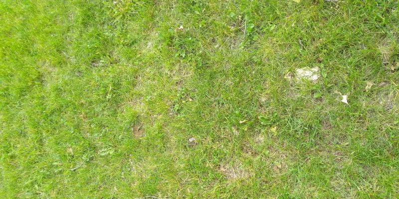

I then turn it to greyscale and darken it significantly while bumping up the contrast:

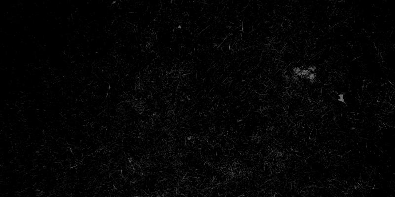

When you use a greyscale image as a layer mask, pure white areas will be opaque, while pure black areas will be transparent, with values in between being semi-transparent to varying degrees. It's an opacity map. I can then take a photograph or dirt, or really any image of the right size with some dark colour, apply this image as a layer mask, set the properties to "multiply," and end up with dark, scratchy areas all over the carbody. But I can milk that image some more. If you're trying to maximize your output while minimizing your time, it pays to get the most out of all of your resources. I copy the layer, rotate it 180 degrees, invert the colours, and set the properties to "addition." I decrease the opacity to 30%. The end result is this:

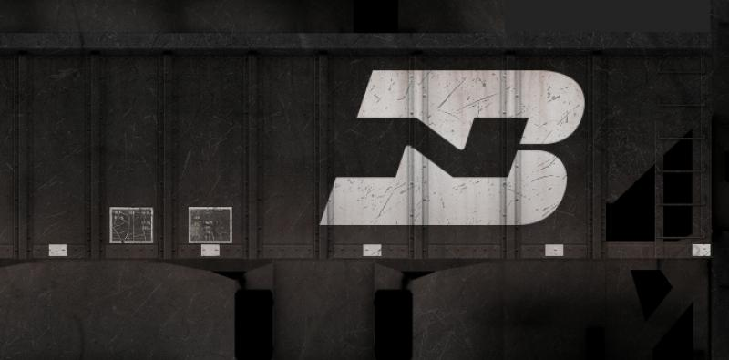

Because the textures for the car are not perfectly symmetrical, it's hard to tell that the light, additive layer is the same image as the dark layer, but rotated 180 degrees. Similarly, I can rotate both images 180 degrees, change the opacity values slightly, and add perhaps another layer of spotty dirt, and those same layers easily create a carbody that looks totally different. You could go back to the original image and flip the scratch layers horizontally for a third carbody, or vertically for a fourth.

I am always on the lookout for walls with streaks of dirt from the rain, rusty metal, or anything that looks patchy. You can get so many great layer masks from those things, and most of us are carrying a perfectly-adequate camera in our pockets these days anyway. I used to hate weathering. Now it's quite easy and enjoyable, taking very little of my time.

=== Highlights and Shadows

A layer, or layers, used for "hard coded" shadows and possibly highlights, which could otherwise be known as the Ambient Occlusion layer, should reside near the DECAL layer and the BASE layer for a decent effect, though you could migrate the highlights layer higher in the stack.  How to create an ambient occlusion layer using the Blender render engine is covered in another section of this document, but if you do create this layer using Blender, this is where it would be inserted.  The color of this layer will essentially be only black and white.  You can always choose to create and edit this layer manually as well. 

[TIP]
The blend mode for the [ao] layer could also be "multiply" instead of "normal"

==== Decals

A newer concept, and one championed by the NAVS technique, is to use a separate bitmap or multiple bitmaps to generate various car numbers without having the numbers backed into the main bitmap.  This gives added flexibility to car rosters as custom car numbers are easily generated without resorting to difficult post-release editing of `.ACE` files and many have done in the past.

A DECAL is a small section of the main model that has a smaller `3d plane` object floated just above the surface of the model. This plane is assigned a set of UV coordinates that map to a specific number or numbers desired on a particular car.   Using the {or}  `INCLUDE` statement in a WAG or ENG file, you can specify decal mapping using the `FreightAnim` keyword to locate the related decal `S` file(s).

I'll share a Decal technique here using individual 64x64 PNG files with alpha-numbers.

== How to Make Night / Snow Textures

(((Texture, Seasonal)))

[NOTE]
Much of this is content is a summary of KUJU supplied documentation

Night textures on shapes are created by editing the original texture,
darkening it and perhaps adding a couple of touches for effect.

The night textures take effect at a predetermined time within the game
environment, so as to replicate a real world environment. The
extshape.dat file must be updated with the correct parameters so that
the shape is declared as having night textures (see the “How to write a
.ref file” document for further clarification). ((( Reference File)))

Once created, the night and day textures must have the same filename so
that the code can pick up the correct texture. This means that the
daytime / normal texture must be entered into the normal route textures
directory and the night version into the route night textures directory.

Below are two textures taken from the Orient Express level. These were
manipulated in a two dimensional drawing package:

image::images/image1.jpeg[]

image::images/image2.jpeg[]

image::images/image3.jpeg[]

image::images/image4.jpeg[]

This means that the texture on the left will be replaced with the
texture on the right once the correct night timing has been switched on.

(((Texture, Snow)))
Snow textures must also be created, so that your buildings and other
objects will look correct when there is snow lying on the ground. These,
too, are created using the original, daytime textures. The extshape.dat
file must be updated in relation to this (see the “How to write a .ref
file” document for further clarification) and must be placed in the
route’s snow textures directory accordingly. The snow texture will only
be used when the snow environment settings have been switched on through
the Drive a Train User Interface.

Below are the snow versions of the textures above.

image::images/image1.jpeg[]

image::images/image5.jpeg[]

image::images/image3.jpeg[]

image::images/image6.jpeg[]

== Creating Shadows

(((Texture, Ambient Occlusion)))

Ambient Occlusion is the generation of hard-coded or `baked` shadows instead of relying in dymanic lighting to generate shadows for an in-game asset.  It provides extra depth to an asset that would not be achieved otherwise.

Marek on Elvas Tower shared how he achieves ambient occlusion on his models and it is shared here.  

[NOTE]
Your model needs to be UV UNWRAPPED prior to baking out an {AO} image as described here.

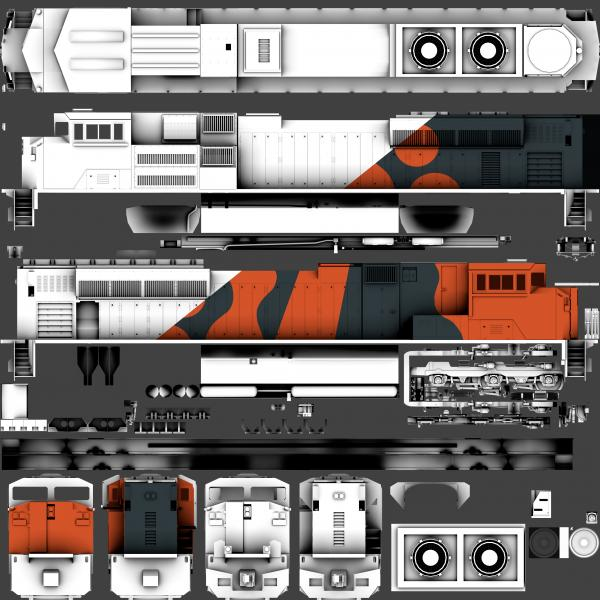

An orthographic camera can be used to render the ambient Occlusion with all projection planes. Clipping planes can then be used on the camera to make certain parts invisible to the render camera, which helps exclude details that are not desired. The renders can then be imported into GIMP (or any other editor that supports layers) and used as the base for the final texture layout. The model can then be unwrapped to that. Livery colors can then be added in layers above the {AO} layers and layer blend modes can be used to create the desired image. This method is more time-consuming than other methods, but it produces results that are far better than what can be achieved by hand in 2D alone.

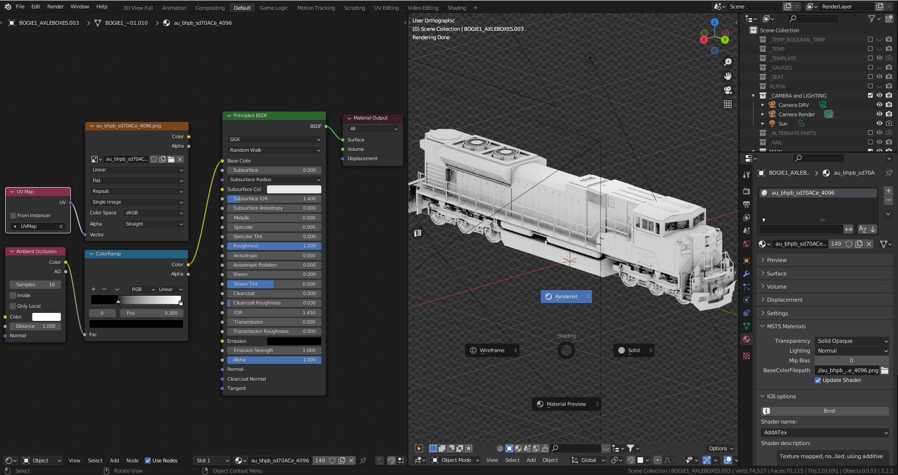

The image above shows a model with a single material applied to it called `au_bhpb_sd70ace_4096`. In the shader editor, two inputs can be chosen for the Base Color of the `Principled BSDF:` either an image file applied to the model at the top or an {AO} shader via a Color Ramp node below it. When exporting to `.S` or wanting to view the texture in Blender, the `texture node` needs to be plugged in, and when rendering the {AO}, the {AO} Shader needs to be plugged in. By setting the 3D viewer to `Rendered`, one can get an idea of what the output will look like and can adjust the shadow effect via the sliders in the ColorRamp.

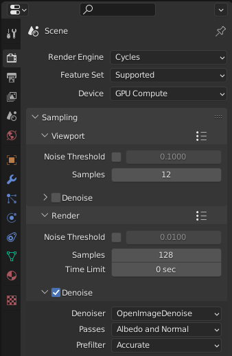

In the Render properties tab, switch your Render Engine to Cycles and your Device to GPU Compute for faster rendering. With a Render sample setting of 128, rendering can take a while on a PC. To get a faster render time when testing, try using a lower number initially. Don't forget to turn on `Denoise` to give you a cleanly rendered image.

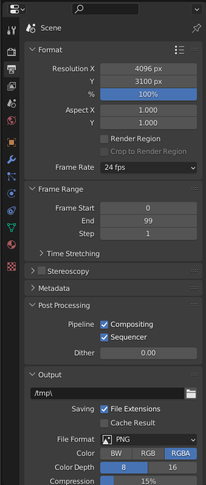

In the Output properties tab,  the  `Format Resolution X = 4096 px` is used because there is a 4K texture being used on the model. You can adjust the Resolution Y value later when you know how much vertical space the render will take (see below).

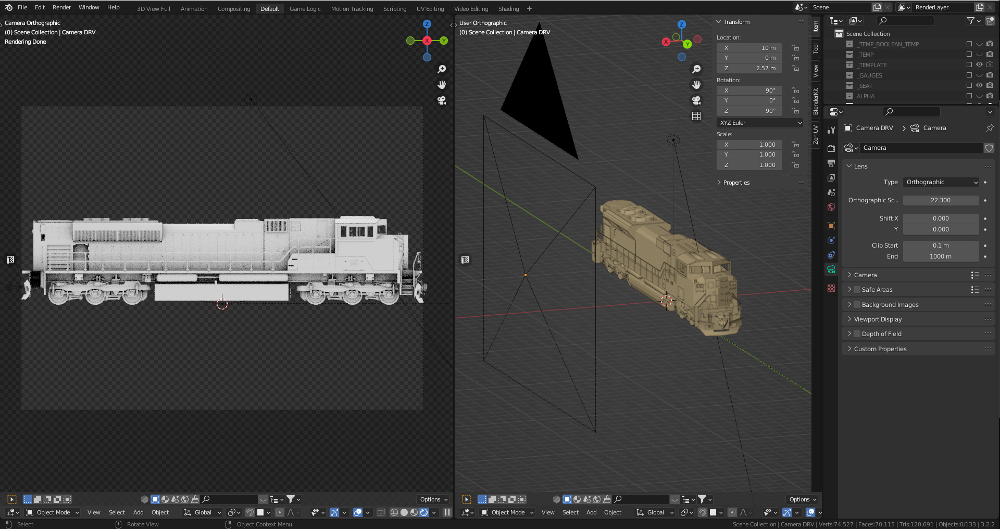

A camera should be added to the scene and moved to the side of the locomotive. The Rotation values in the Properties tab should be used to ensure that it is perpendicular to the locomotive. On the Object Data Properties tab, the Type of Camera should be changed to Orthographic. A separate 3D viewport should be opened and the Camera should be selected and kbd:[CTRL + Num 0] should be pressed to get a side view of the locomotive from the camera's point of view. If it is not already in Rendered view, pressing kbd:[Z] should allow for Rendered view to be selected; the {AO} shader should be visible in the camera view. 

The Orthographic Scale should be adjusted for the camera so that the entire length of the locomotive body fills the camera view (for this locomotive, the scale is 22.300). The camera should be moved in the `Y` and `Z` axes to ensure that it is in frame. Then, the `Format Resolution Y = value` should be adjusted so that no empty space is rendered above and below the locomotive. When the entire locomotive is framed in the camera view, kbd:[F12] should be pressed and Blender will render the {AO} into a new window.

If denoise is enabled, the rendering may appear to hang, but it will complete after a while. Making multiple copies of the camera and moving them to the sides, ends, top and bottom is recommended in order to render the {AO} from the different projections. Keeping the `Orthographic Scale` the same on all the cameras will result in the render being at the same textural density. Additionally, unlike a perspective camera, the distance of the camera from the object does not change the size of the resultant render.

Once you have finished rendering the image, you can save it to your computer and import it into your 2D graphics program to use as a base for your texture. To make sure the texture has the same textural density, you should make multiple copies of the camera and move them to the sides, ends, top and bottom. Again, unlike with a perspective camera, the distance of the camera from the object will not affect the size of the render. However, the hand rails may obstruct the details on the body behind. To fix this, you have multiple options.

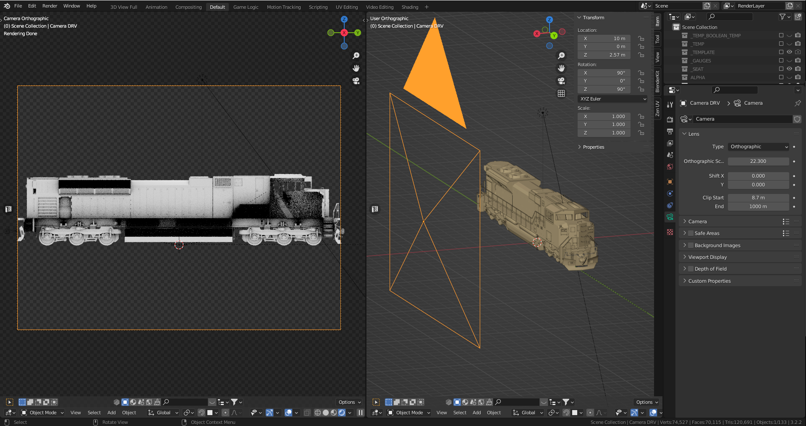

In the image above the `X` location of the camera is 10m to the side of the locomotive.  The `Clip Start` distance has been changed from its default value of 0.1m to 8.7m. When rendered, the view no longer includes the handrails but displays the side of the body as the camera is drawing what it can see from 8.7m to 1000m, beyond the hand rail closest to the camera. This clipping results in the cab side, fuel tank and air tanks being cut off. The same outcome can be achieved by keeping the `Clip Start` and `End` at their default settings and moving the camera in the `X` direction, allowing for 'slices' of the scene similar to an MRI machine.

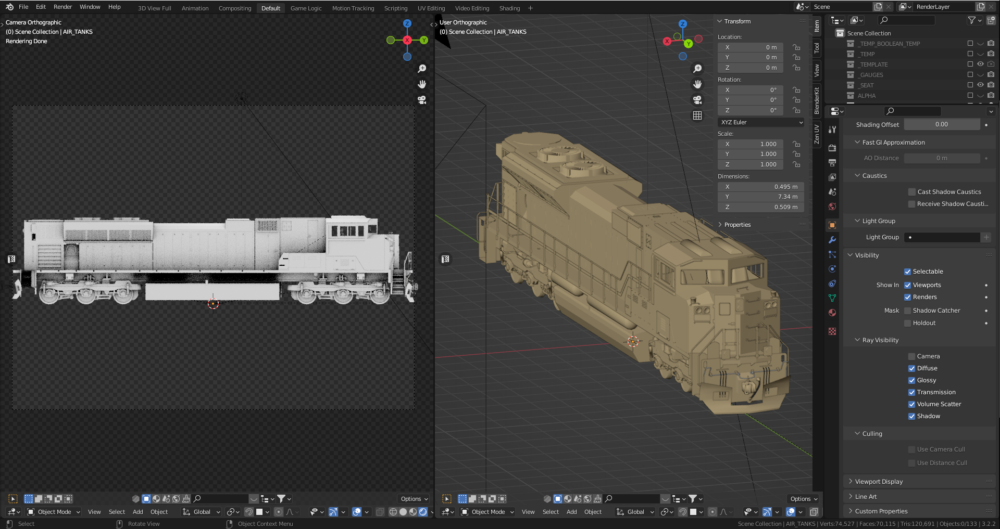

It is possible to make parts invisible to the render camera. In the image, the `Camera` checkbox in the Object Properties tab for the hand rails and air tank objects has been unchecked. This results in the entire side of the locomotive body being visible in the render view, but the handrails and air tanks not being rendered. These methods can be used to exclude objects in the foreground that are not required for the desired image.

The {AO} can be rendered for all the different views and then mashed together in a 2D graphics program to export as the `au_bhpb_sd70ace_4096` texture to use for unwrapping and in Open Rails.

This technique for Baking {AO} is a good way to get the added shadow details on a texture but the method described here is not the only way to accomplish {AO} shadows.  It might not be the most effcient way either, but it seems to work.

[NOTE]
It is important to be aware that any lights in the scene, including environment lighting, will impact the rendered {AO}. Lights are not used when baking an {AO}, so if the rendered {AO} image is too dark, the environment brightness can be increased or area lights can be added, typically the length of the locomotive, placed on either side to minimize shadow casting. If the lighting is changed later on, this will impact subsequent renders and will not match earlier renders. It is essential to be aware of this.

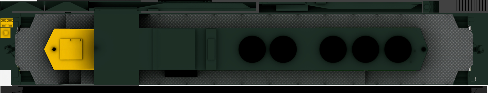

