== Making A 3D Model
 
=== Some Basic Things About 3D Models.

Scale:: {ORTS} as well as {MSTS} each use a scale of 1:1, that is, 1 unit in the 3D drawing area is 1 meter in the simulator and this means all things are in real-world measurements. 
 
3D Space::  According to *Blender's view of the world*,  `-X` value is left, `+Z` value is up and a `-Y` value is the front side of the object. The "ground" level is where `Z`=0 

Material:: In Blender, a material is a set of properties that defines how a surface appears when it is rendered. Materials can include information about the surface's color, texture, reflectivity, transparency, and other visual characteristics.

[WARNING]
When creating rolling stock items for ORTS, Pressing kbd:[Keypad 1] for front view will actually have you looking at the REAR end of the car or engine. You would press kbd:[CTRL, Keypad 1] to get a front view of your engine or wagon while drawing it.  You have the potential to create backwards rolling stock if you get this wrong.
 
The *MAIN* object of your modeling collection should always be positioned at world origin, which is `X=0`,`Y=0`,`Z=0`, based on the orientation described above.

[TIP]
There are some general rules that all content creators should follow, regardless of the tools used. Take the next section to heart.

[NOTE]
While you _can_ have Blender work in Imperial units (feet and inches), I find it far simpler to always work in the Metric System and you won't need to change the "UNIT" settings in Blender.

=== Some Basic Things About Modeling

Some recommendations From Erick Cantu of NAVS

1. In {OR}, it is important to try to keep the polygon count of your models low, even though it is not as critical as in some other applications. While modern PCs and simulator software have improved in their ability to handle complex models and textures, it is still important to use complexity wisely. In Blender, you can view the polygon count and other details of your model by going to Object EDIT MODE and looking at the lower right corner of the screen. When creating your models, try to avoid including faces and edges that will rarely or never be visible in the final model.

2. Keep the texture files (that will eventually be included with your final model) to a minimum and use as much of the allotted texture as you can.  Each texture creates a fresh API call (state change) to a new group versus being able to batch calls together to a single texture.

3. The most important tip. Don't get hung up drawing things that nobody will see.  Avoid drawing details that will remain in shadows or small details like nuts and bolts if the camera will never see it.  Inversely, now that we have the ability to have more complex models with {or}, we *can* add more modeled details where we historically were forced to rely heavily on alpha-channels in our textures. 

=== Polygon Count and Vertex Density

If you read item #3 in the previous section, you might think you can go crazy with details.  However, there is always a balance to be achieved not just between graphical quality and performance, but also in computational performance. Every vertex that has to be mapped to a texture takes computing power. Thus, it's good to save polygons whenever possible and use texture maps instead for details like cutouts, structural members, and bolts. If you really feel like you want to model small details, keep in mind that every detail added might prevent the more generic use of the model for re-skinning later on.  A flat sided boxcar is more flexible than one with specifically modeled door layout, latches and modeled roof details.

For large panels, though, a minimal amount of modeling is necessary. A flat plate like a wall or door can be made with only a few polygons.  Like every rule, you can break it when you really want to show a particular detail, but also keep in mind that you should make good use of "Level of Detail" ranges (LOD) to reduce computational work when an object is farther away.

=== Preparation of Work

* Of course, you need to figure out what you want to model
* Find some design references (Blueprints, Scale Drawings). Referring to back issues of model railroading magazines can be helpful.  There are also some railroad cyclopedia books for sale that were published by Model Railroader Magazine as well as issues of Railroad Model Craftsman. 
* Create a collection of reference images, if doing modern content, grab your camera and snap some of your own references. There are a few railroad picture sites that are highly useful as well. (https://www.railpictures.net/, http://www.rr-fallenflags.org/, https://www.railcarphotos.com/) 
* Determine which images you will use for background references in Blender.  You should have available at least side and front images.  In some situations, you can use the same image for both if the views are present.  

=== Background Images

It is important to note that many scanned images of drawings and plans that can be found online may contain errors, as they are often reduced in size to fit on scanners and screens. Older plans, which are often very large (nearly one meter wide), are particularly prone to this issue. Plans created using computer-aided design systems tend to be more accurate and smaller in size, but these are less common and may only be found in hobby magazine articles. Some plans may also be stored as vectors, which allows them to be scaled without loss of quality. Keep these limitations in mind when using background reference images.

Original Plans:: There are web sites online that will sell you scans of original plans.  These are often related Railroad Historical Society websites.  Unfortunately, there are large images and often quite costly.  Example: https://www.nwhs.org/archivesdb/

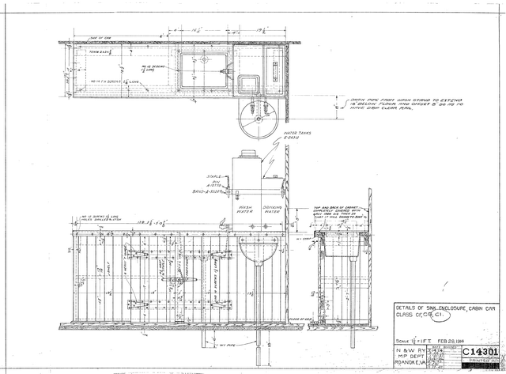

General Drawings:: These are often found in back issues of Model Railroader and Railroad Model Craftsman magazines as well as sites like https://www.trainiax.net.  These usually contain a good about of Steam Engine, Diesels and Rolling Stock but might lack all the details such as piping and such. These drawings are made based on originals by the staff of the magazines or staff that created the Cyclopedia collections.  These have the ability to be a few percentage points off-scale even when they include a scaler reference.  

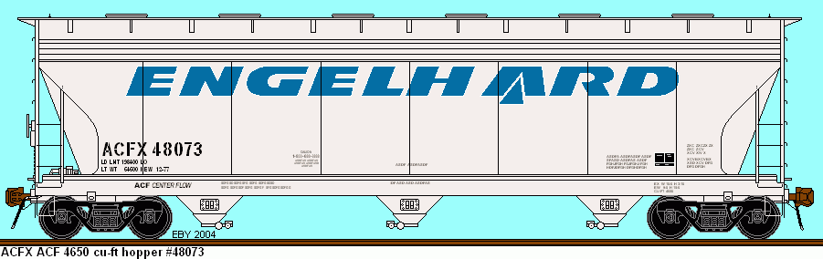

Classification and Painting and Lettering references :: These seem to be rather plentiful and contain lots of useful dimensional data.  They are often from discarded rail road documents and might have notes scribbled in them.  The drawings are often hand drawn and might be a bit messy.  They are not that useful for small details but can get you started on a model if you also have good pictures to refer to.

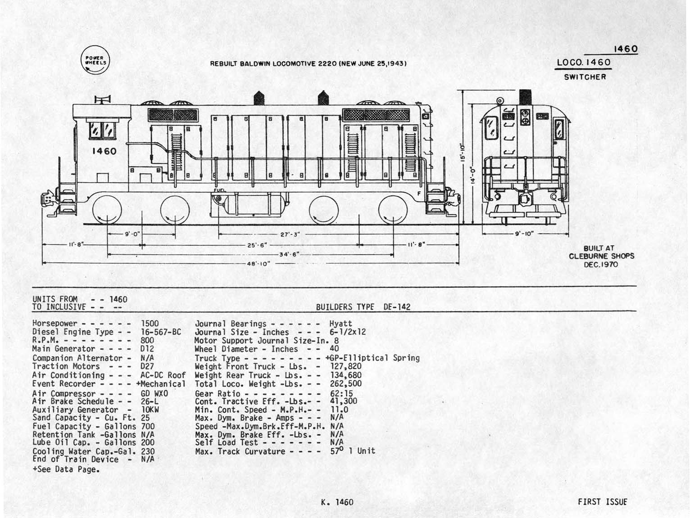

Blueprint Websites::  Sites like http://www.the-blueprints.com offer a variety of drawings to choose from.  While this might seem like a good resource, I would use it with caution.  The content is all user generated so there are varied degrees of clarity and accuracy.

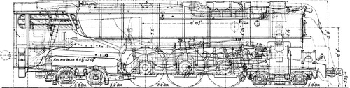

[NOTE] 
Using background images is optional, but many modelers use blueprint backgrounds as modeling aids.

When inserting background reference drawings into Blender, it is not critical that you match up the image size to equal world space dimensions, but it can save a lot of re-scaling steps later. One of the main issues with using backgrounds in Blender is that some methods you might be accustomed to with other modeling tools don't work in Blender, such as applying backgound image to a cube and using that as your reference, since in Blender, you only see the texture in a texture viewing mode. It will dissapear in Xray/Wireframe and even solid shading modes. 

When you insert a background using Blender's menu:Add[Image > Background],  the image WILL show up while you are in wireframe modes... but note that by default the image will ONLY be visible from the axis it faces. Be careful when you install a background image as you need to to be in the Axis View you want, since the added image will orient itself to your current view.  If you want to change this, you can enable the `Perspective View` check-box by clicking on the `EMPTY` and adjusting the setting it's properties window.

Background images are added to our scene as `EMPTIES`, which means that they are not going to be part of an exported model.  To avoid accidently moving or changing the background image, you can use the filter options in the outliner, first enabling the "mouse cursor" icon and then setting the restriction toggles to disable the "mouse cursor" icon for the empties you added to the list, which will prevent you from accidently selecting the background images.

The outliner filter options are pretty handy as you can also SHOW or HIDE the background image empties as needed by clicking the "eye" Icon.

A nice feature of the Image Background is the ability to adjust the ALPHA setting, controlling the with the "transparency" slider  to get a see-through effect.  First, click the Opacity check-box  to enable the feature and then adjust the opacity slider to your liking.

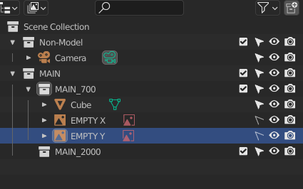

[TIP]
If you want to save the background images INTO your .Blend file, you can use the menu:File[External Data > Automatically Pack Reources], which is OFF by default.

When using background images and modeling a freight car, for example, you would first figure out the distance between truck centers in meters and match the background drawing scale using the grid in the 3D view.  Adjust the background image scale using the kbd:[S] and position using kbd:[G]. 

[TIP]
Speaking of working with images, Blender has an add on that you can install called "Insert Images as Planes". The ADD menu will now have this option available.  It will assign the material of the image to the plane and allow you to rely on things like ALPHA masking.  It is also affected by scene lighting, but like I mentioned above, this texture will only show up in a TEXTURE view mode, so this feature is not useful for a background refrence drawing. 

=== Some things I will miss about using 3D Canvas

I will digress for a moment to share one of the reasons why using 3D CANVAS was so helpful in the initial stages of making a model.

3D Canvas/Crafter has a train content ENGINEER add-on `Trainworks -> Train Simulator Engineer` that behaves as a quick start tool which places fully modeled wheels, axles and truck shapes and the base body element, all of which are customizable.  This add-on is sorely missed in Blender as nothing even close to it exists.  In reality though, it only saves you a few minutes.  If you have a ready made truck-set and couplers, for example, it is pretty easy to import and place them at the correct location. 

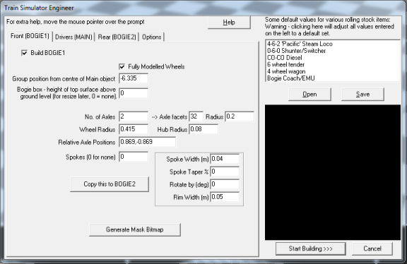

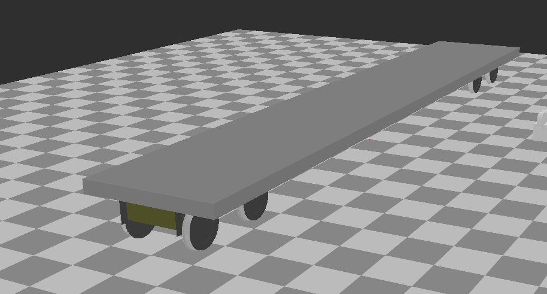

Since this is really just a set of preset shapes with customizable values and locations, it's not impossible to consider that Blender's scripting language could be used to recreate the same tool using Python.  While I'm not in any position to create this Blender Script myself, it would be a welcome sight to see one or literally any thing else {OR} related beyond the existing `.S` File Exporter we have from Wayne Campbell.

Using this plugin with 3D Canvas we haven't even started modelling yet and we have a number of things in place.  In Blender, however we are going to have to create all of this content ourselves.

[TIP]
====
Something we could do with 3D Canvas  was  to enable "render 2-side faces" and it is not very clear how to do that with Blender. So, let me explain: 

To create a double-sided plane in Blender, you can use the following steps:

1) Start by creating a new plane in Blender. You can do this by going to the "Add" menu in the 3D View and selecting menu:Mesh[Plane].

2) With the plane selected, go to the "Object" menu in the Properties panel and enable the "Double Sided" option. This will cause the plane to be visible from both sides.

Alternatively, you can use a Solidify modifier to add thickness to the plane and make it double-sided. To do this, select the plane: 

1) Go to the "Modifiers" tab in the Properties panel. 

2) Then, click the "Add Modifier" button and choose "Solidify". 

3) In the Solidify settings, you can adjust the thickness of the plane.

If you want to apply the Solidify modifier permanently to the plane, you can do so by clicking the "Apply" button. This will apply the Solidify modifier to the plane and make it double-sided.

====

<<<

=== Where to start?

I feel like we can try to make a simple scenery object as a first project and try to make it by manipulating the default cube. 

==== Do we need a quick 3D Modeling primer?

A basic Blender concept is that  you will spend a lot of time with your right hand on the mouse and your left hand typing keyboard shortcuts. Blender is very much still a key-based program, though in recent releases with the additional of optional pie-menus and onscreen widgets, you can initiate quite a number of operations with just the mouse or a single key press and the mouse.

Every piece of 3D software I've used is based on a set of core concepts and constructs.  These are often called primitives and Blender is loaded with them.  By far, the most used primitive when creating new hard surface models is the `cube` closely followed by the `cylinder` and `plane`.  Blender refers to these items as "mesh objects".  

By adjusting the scale, rotation, and location or by adding to or subtracting from the faces, vertices and edges of these primitives, we can create the various adjustments and transformations needed to create a particular shape.   It is honestly a bit overwhelming at first. The only way to learn how to become better and faster a is by *not* only watching or reading tutorials, but by just "doing it" in Blender yourself.  

[NOTE]
So, of course I mean that you should watch and read tutorials to get better acquainted with Blender features. However, you are still going to need to just try and make a few things yourself. For example, my first real export into {or} was a 12' long Jersey style concrete barrier.  Nice and simple.

image:images/barrier.png[]

[TIP]
My experience has been that I begin to work on something with the complete understanding that I will trash it, or some of it, as I discover a better way to do it.

As I said, Blender isn't the easiest program to learn, but even a first-week novice should be able to produce a simple model like the one above using a few fundamental commands: 

[cols="30,70", options="header"]
|===
| KEY| ACTION
|   kbd:[G] | Grab - To Move things. Can be followed by an Axis option and distance option
|   kbd:[R] | Rotate - Can be followed by  Axis and  Angle options
|   kbd:[S] | Scale - Can be included with other keys to limit scaling to desired axis
|===

[TIP]
Pressing kbd:[GG] as in pressing the kbd:[G] key twice, will allow you to SLIDE move along an edge.

[TIP]
When scaling with the mouse, the closer your mouse is to the object, the more impact the mouse has on scale movement.  If you want more control, begin the kbd:[S] operation with the mouse cursor further way from the selected item's origin.

These keys can manipulate basic objects. By using these keys and following them with additional commands like kbd:[X], kbd:[Y], or kbd:[Z] 
you can constrain actions to the specified axis.  By pressing kbd:[SHIFT] prior to an axis key, you remove it from the list.

Example1::  By pressing the sequence:  kbd:[G] kbd:[SHIFT] kbd:[X] you will be able to move the selected item in the `Y` and `Z` axis, but not `X`.

=== The Modeling Interface

This is the initial default screen layout you will see when you start up Blender. 

[NOTE]
For added clarity on printed copies of this document, I’ve switched to a high contrast theme in Blender Preferences.  (Prefereces-->Themes-->Presets[Pulldown for options])

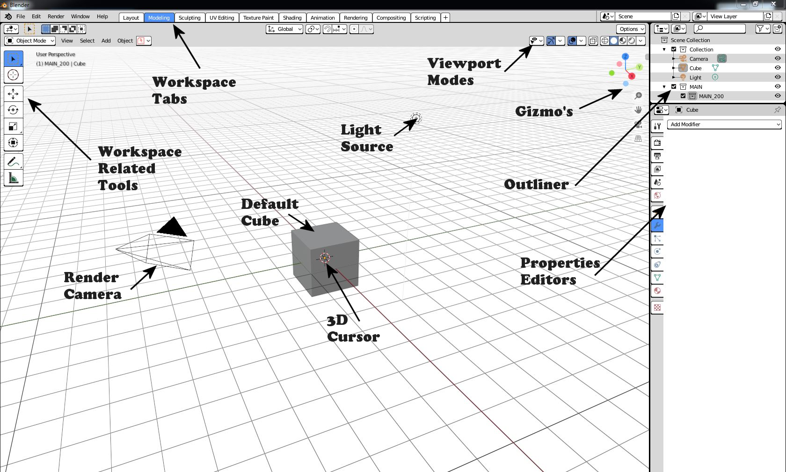

The 3D cursor is where any new object will be placed. By default it is at world origin `0,0,0` but it can easily be moved to new locations.  The position of the 3D Cursor can also be manipulated using the cursor widget on the left side panel. It is available in both OBJECT and EDIT MODE.  You can also place the 3d cursor position using the kbd:[Shift,S] `SNAP` Pie Menu.

<<<
==== Shortcut Keys

*MENUS*

To hide or reveal the Number Panel on the right side use  kbd:[N] key   (Not shown above) +
To hide or reveal the tools Panel on the left side use kbd:[T] key +
To see your "Quick Favorites" menu, use the kbd:[Q] key +
Use kbd:[F3] for access to the search feature +
Use kbd:[CTRL+TAB] combination for access to the `MODE` pie menu +
Use kbd:[~] for access to the `VIEWPORT` pie menu +
Use kbd:[.] for access to the `PIVOT POINT` pie menu +
Use kbd:[,] for access to the `AXIS ORIENTATION` pie menu +
Use kbd:[SHIFT + S] to access the `SNAPPING` pie menu +
Use kbd:[Z] to access the `VIEWPORT SHADING OPTIONS` pie menu +

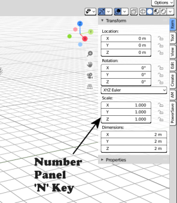

The above image shows what it looks like when rolled out. It is also where some installed add-ons will show up.

*VIEWS*

Use kbd:[HOME] to show all objects +
Use kbd:[H] to hide a selected object +
Use kbd:[ALT + H] to un-hide all objects +
Use kbd:[SHIFT + H] to show all objects +
Use kbd:[ALT + Z] to toggle X-Ray mode +

The Number Pad Keys are also used to select various views.

==== View Controls

[NOTE] 
There is a check-box option in menu:Preferences[Input > Emulate 3-Button Mouse] for people who do not have a Middle Mouse Button.  To create a kbd:[MMB] press while this mode is enabled, you hold kbd:[ALT] while pressing the kbd:[LMB].  There is also a checkbox to EMULATE the number pad for systems that lack a keypad. This option will enable the number pad key mapping on the TOP ROW number keys instead. (This will affect some options, like switching edit modes for vertex, line and face) 

Orbiting:: Select the default cube and press and hold your middle mouse button, kbd:[MMB].  Moving the mouse right and left, you will orbit your view around the selected object.  

Panning:: Select the default cube and press and hold your kbd:[MMB] and then press the kbd:[SHIFT] key. Moving left and right will PAN left and right on the screen view.

Snapping:: Select the default cube and press and hold kbd:[MMB], then press the kbd:[ALT] key and by moving left, right, up, down you will snap the screen to various orthographic views.

Zoom:: Select the default cube and press and hold kbd:[MMB] and then press the kbd:[CTRL] key. Moving up, down will zoom the views in and out. You can also use the mouse kbd:[SCROLL WHEEL]

Camera View:: Pressing the kbd:[INS] key on your keypad will toggle the Camera View. In this view, you will see what the camera sees of your screen which is also what your render will output.

Zoom to Selected:: Pressing the kbd:[DEL] key on your keypad will zoom in and give preference to the selected object. 

Front/Rear View:: kbd:[Keypad 1] / kbd:[CTRL,Keypad 1]

Side View Left/Right:: kbd:[Keypad 3] / kbd:[CTRL,Keypad 3]

Top/Bottom View::   kbd:[Keypad 7] / kbd:[Ctrl,Keypad 7]

Rotate Z axis:: kbd:[Keypad 4] & kbd:[Keypad 6]

Rotate X axis:: kbd:[Keypad 2] & kbd:[Keypad 8]

Toggle Perspective and Orthographic view modes:: kbd:[Keypad 5]

[TIP]
Most of the time, you will be using the default `BOX SELECT` mode of the Arrow (Select) tool.  Use the kbd:[B] to switch back to `BOX SELECT` if you end up changing it from default. Other modes include `CIRCLE SELECT` kbd:[C] (Note, use `RMB` to exit `CIRCLE SELECT` mode), and `LASSO SELECT` kbd:[CTRL,RMB].  The kbd:[W] key will cycle between modes sequentially.  You can also *INVERT* selections by using  kbd:[CTRL,I] and add to an existing selection by holding kbd:[SHIFT] and selecting with kbd:[LMB].

*BOX SELECT ICON*

You can move around using the mouse with the screen gizmos (X,Y,Z)in the upper right.  The multi-color Axis tool will allow you to drag to a new orientation, the Magnifier is for Zoom, the Hand is for panning , the Camera icon will toggle the Camera view and the Plane icon will toggle between Perspective and Orthographic.  These on screen items are helpful when using a laptop that does not have a keypad. 

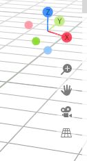
*ON SCREEN GIZMO*

<<<
=== Modeling Modes

(((Blender, "Modeling")))

In Blender, there are 2 primary 3D model manipulation modes.  These are `OBJECT MODE` and `EDIT MODE`.   

Use the kbd:[TAB] key to switch modes.

OBJECT MODE:: With `OBJECT MODE`, which is the default mode in Blender, actions are available for all object types since this mode is dedicated to Object data-block editing (e.g. position, rotation, size) as well as Modifiers.  Edges, Faces and Vertices cannot be modified in this mode.

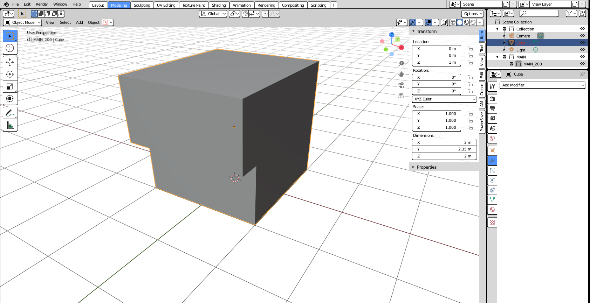

In this mode, you can select individual objects that make up your design so they can be further manipulated in `EDIT MODE`.

In object mode, the following shortcut keys are useful:

Use kbd:[SHIFT + A] to Add a new object +
Use kbd:[SHIFT + TAB] to toggle `SNAPPING` modes +
Use kbd:[CTRL + A] to Apply transformations +
Use kbd:[CTRL + J] to Join objects together +
Use kbd:[SHIFT + C] to reset cursor to center +
Use kbd:[SHIFT + D] to Duplicate the selected object +

<<<

EDIT MODE:: The *selected* item in `OBJECT MODE` becomes the focused object when moving to `EDIT MODE`. `EDIT MODE` is a focused mode and you will not accidentally select other parts of the model in this mode. This mode available for all object types that can be rendered, as it is dedicated to manipulating their “shape”. The `EDIT MODE` allows adjustment of Vertices, Edges and Faces for mesh object types as well as the control points for curves, surfaces and points.  

[TIP]
In `EDIT MODE`, the object selected will show Vertices, Edges and Faces.  Selected edges, vertices or faces will adopt a highlight color when selected. Also notice the larger tool set on the left compared to `OBJECT MODE`.

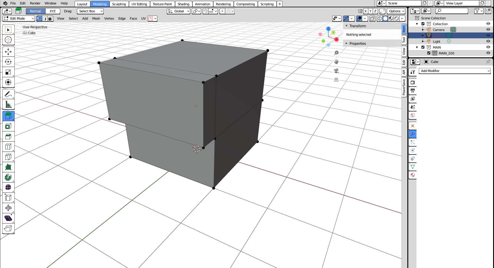

In Edit mode, the following shortcut keys are useful:

Use kbd:[1] Vertex Mode +
Use kbd:[2] Edge Mode +
Use kbd:[3] Face Mode +
Use kbd:[P] Create Separate objects from the selection in various ways +
Use kbd:[F] Fill Face +

[NOTE]
There are 3 sub-modes in `EDIT MODE`; kbd:[1] Vertex Edit, kbd:[2] Edge Edit and kbd:[3] Face Edit. 

<<<

=== The 4 major edit-mode tools you are likely to use the most are listed below.

[NOTE]
There are now thousands of YouTube videos about modeling in in Blender if any of these concepts mentioned here are not clear.

==== EXTRUDE
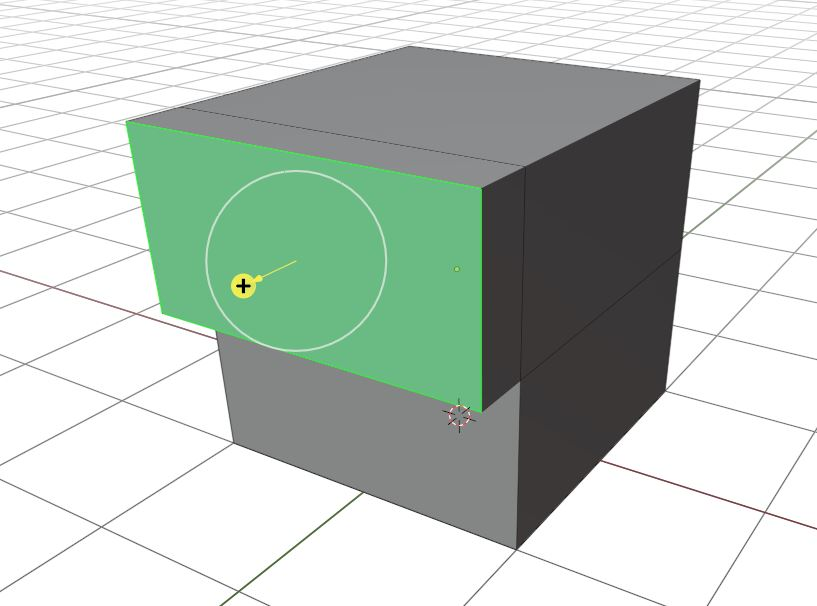

kbd:[E] Key:: The official definition of the extrusion operation is: _The `extrusion` operation duplicates vertices, while keeping the new geometry connected with the original vertices. Vertices are turned into edges and edges will form faces._

There are various options with extrusion operations that define how the extrusion will behave, these include "Extrude Region", "Extrude Individual", "Extrude Edge".  Extrude works by shifting position along "Normals".

[TIP]
When using EXTRUDE and you don't get the behavior you wanted, try using kbd:[ALT,E] to get the Extrude Options pop-up menu. Try the other EXTRUDE options. 

[TIP]
When using EXTRUDE, you can extrude to the mouse gizmo location (MOVE MODE) in by using kbd:[CTRL,E] and right click. This object tool is directly under the ARROW SELECT tool.

[IMPORTANT]
If you select extrude and accept the extrude without dragging a distance away from the selection, the extrude "still happened" even though you might not be able to see it.

<<<

==== INSET

kbd:[I] Key:: This tool takes the currently selected faces and creates an inset of them, with adjustable thickness and depth. (For clarity, we are referring to the letter `i` on the keyboard)

*  Select the faces to inset:

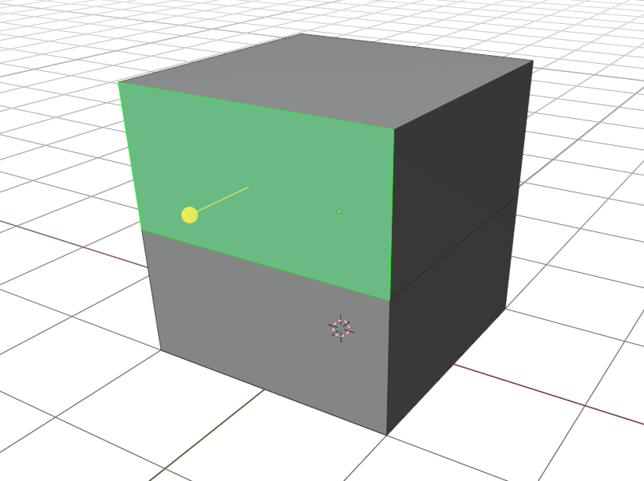

* Press I to inset:

image:images/insetb.png[]

[TIP]
When you use inset and the inset amount appears to be unevenly applied, you likely have not applied your scale transformations to the underlying object ahead of time.  In other words, your scale values in the object transformation numbers panel are not all set to 1.00.  You correct this in `OBJECT MODE` by selecting `OBJECT->APPLY->SCALE` from the top menu. 

[TIP]
You might need to press kbd:[I] again to enable INDIVIDUAL ORIGINS if you notice that inset is not doing what you expect.

<<<

==== BEVEL

kbd:[CTRL,B] Key Combination:: The Bevel Edges tool works only on selected edges with exactly two adjacent faces. It will recognize any edges included in a vertex or face selection as well, and perform the bevel the same as if those edges were explicitly selected. In “vertex only” mode, the Bevel Vertices tool works on selected vertices instead of edges, and there is no requirement about having any adjacent faces. 

The Bevel tool smooths the edges and/or “corners” (vertices) by replacing them with faces making smooth profiles with a specified number of segments.

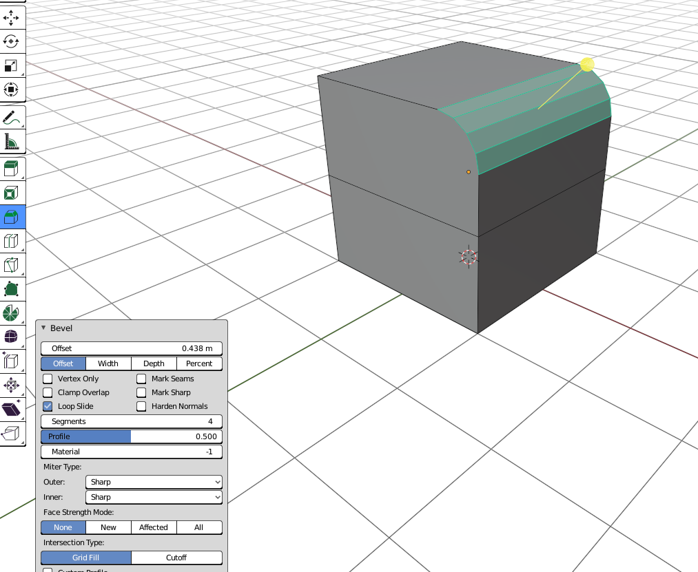

[NOTE]
A Bevel on a FLAT PLANE will create an INSET.

<<<

==== LOOP CUT & SLIDE

kbd:[CTRL + R] Key Combination:: This tool splits a set of faces by inserting new edge loops intersecting the chosen edge(s). It will preview the loop cut as you move the mouse cursor around the object, snapping from horizontal to vertical based on position.  The Loop-Cut will stop at `NGON` Intersections so it is better to use this tool early before you add a lot of geometry changes or booleans. If your mesh has non-NGON shapes, IE; it has been triangulated already... then this and other some other tools won't work as expected.

Press kbd:[E] if you want it to evenly match one of the adjacent edges.

Press kbd:[F] will flip the sdge it matches

Use the Scroll Wheel on your mouse (before pressing kbd:[E]) to add or remove additional cuts.

After btn:[Left-Clicking] the mouse, you can slide  the loop cuts up or down and btn:[Left-Click] again to confirm.  kbd:[Right-Click] center the Loop Cut.

The operation has an "Adjust Last Operation" panel where you can still adjust some values. Use btn:[F9] to open this option if you don't see it on the screen.

[TIP]
For more precise adjustments, you can turn on the "Edge Length" feature in "Viewport Overlays" to visually see the edge lenths.

[TIP]
The "smoothness" value will scale  the selected loop cuts using a fallof profile.

[TIP]
You can use the function kbd:[CTRL-F] or Search for "Tris to Quads" to un-triangulate a shape to possibly regain the ability to use the Loop Cut options again.

[TIP]
====
Later on... you can also shift selected vertices or edges with kbd:[GG] (G twice) to slide the selected vertices along edges... (You can do this with faces as well, but, well, its usefulness is limited.)

You can use the mouse to SLIDE the the selected edge loop(s) into position before confirming. You can add multiple edge loops at once  by using the scroll wheel on the mouse or by entering a value with the keyboard before confirming.

You can also use the options box that shows up in the bottom left of the screen to adjust parameters manually.
====

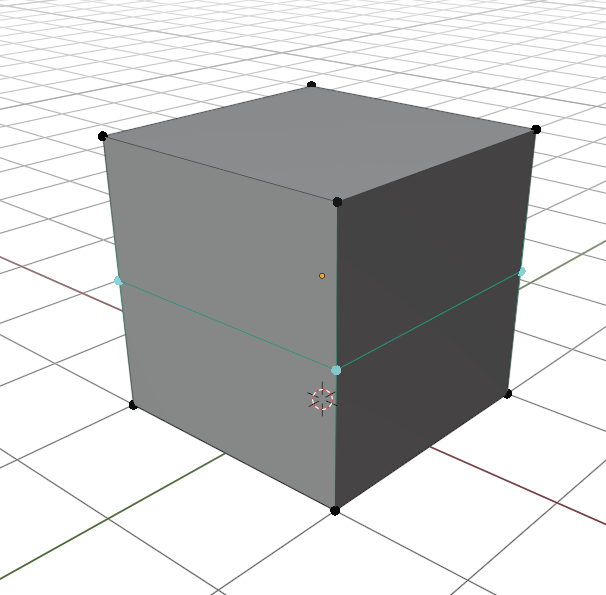

<<<

=== Additional Tips

Here are some tips from some lessons I've learned while using Blender.

==== MIRROR and FLIP

Sometimes, when working on a vehicle model particularly, you might find that using the MIRROR option is not enough. You might also need to FLIP the item along an axis.  For example, lets say you are adding coupler lift bar to your model and you have finished adding it to the rear end of your model. You now want to do the logical thing and mirror it to the opposite end of your model.  But, mirror alone will have the part end up on the opposite end of the model, but on the same side of the model.  It needs to also be flipped.

STEPS:

* On your active part (coupler lift bar), kbd:[CTRL + A] and choose,  "Apply Rotation and Scale"
* kbd:[RMB], from pop-up menu. choose "Set Origin to 3D Cursor", assuming 3D Cursor is current World Origin.  If not, it should be for this.
* kbd:[Shift + D] to duplicate the current object, then chose menu:Object[Mirror > Global Y]
* And finally, flip it. kbd:[S X -1] which translates to `SCALE`, in the `X` axis, amount `-1`, which will FLIP the object in the X-AXIS.

[NOTE]
You might be tempted to try to use the Mirror Modifier, however, that operation will ultimately LINK the objects and the option within the modifier that says "FLIP X" actually actually doesn't do what you might think.  The FLIP option here changes the active side of the Mirror.  

==== Additional Modeling Tips

* Model one side of the mesh and mirror it to the other size using the Mirror Modifier. This helps to make sure you get symmetrical results
* If you have an item that will be replicated many times, like a handrail stanchion, create one, UV Map it and then replicate it. You can shift the UV coordinates later, but you only need to uv map it once
* Add MARK SEAM and MARK SHARP settings while you work instead of saving these steps for later
* Export your model as soon as you get the initial UV mapping completed so you can find issues earlier rather than later as a time saver
* Remember that you can `hide` and `un-hide` collections and objects in the Outliner to help with focused modeling
* Remember to use `Smooth Edges` and `Auto Smooth` settings

=== Setting up your Initial Workspace

[TIP]
====
You have a way to set some custom options that you always need to change and then save that as default to avoid having to perform those changes when you start a new project.

The default workspace in Blender 2.8+ is something you will see in a lot of in YouTube tutorial videos. The first thing they will often do is select and then delete the "default cube".  Rather than go through this every time, it is possible for you to delete it, and then save your current cube-less `.blend` file as your new startup file. (I don't actually recommend it though) 

(((Blender, "Workspace")))

`FILE->DEFAULT->Save Startup File`
====

[WARNING]
Before you do that just yet, go over to your `Outliner` window... and do the following:

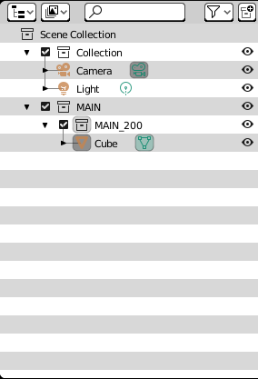

1. Create a new collection by clicking the `box icon` in the upper right `Collections` window with a plus sign on it. Create a new collection called `MAIN`. (All uppercase)
2. Click the new collection `MAIN` and then create a new `Collection` again so it becomes a child collection under `MAIN` and call it `MAIN_0700` for LOD distance, or use any LOD distance value that makes good sense to you. 
3. Now click on `SCENE COLLECTION` at the top and rename the original main collection to `Camera`.
4. Drag and Drop the Camera object into `Camera`.
5. Now you can save your `.blend` file as your default startup file and you will have the scene outline setup that will work with the MSTS exporter.
6. Optional: If you are going tocontinue to use the default cube, drag it from where it is to the MAIN_0700 collection.

[TIP]
You would later create as many LOD based MAIN_xxxx collections as needed for your model.

image:images/MyCollection.JPG[]

[IMPORTANT]
----
You will want to download and install the "Blender 2.8 to MSTS Exporter".  https://github.com/pwillard/Blender_MSTS_ORTS_Exporter/blob/main/Blender_MSTS_ORTS_Exporter.zip

The Documentation is included in the ZIP file.  The documentation is also available separately at this location: https://github.com/pwillard/Ebook-MSTSORTSExporter/blob/main/MSTSORTSExporter.pdf  Use the DOWNLOAD button to get a readable local copy.

----

== Actually Modeling Something

This is a quick tutorial on general model building.   To get started, we are making a very simple scenery item.

=== Model Building Exercise #1

 * We are building a very simple shape without using a background image.
 * We only need a few general dimensions.  
 * We will re-make my first Blender project for MSTS;  The Jersey Barrier, 12', by 42" by by 32". 

Key items to take away from exercise #1

* Object and View Manipulation
* Basic Edit Tools
* Quick UV Texture Mapping

[NOTE]
For added clarity on printed copies of this document, I’ve switched to a high contrast theme found in Blender Preferences. 

* Start with the default cube, and select it with kbd:[LMB].
* Shift it up 1 meter. kbd:[G] kbd:[Z] kbd:[1] kbd:[ENTER]
* As an aid to modeling, pull out the right side number panel by pressing kbd:[N] 
* Scale to 42"  (Z Height = 1.077m)   Manually enter 1.07 in the Z dimension field.
* Shift it back to ground level.  kbd:[Keypad 3] on keypad for side view, kbd:[G] key kbd:[Z], drag down to about ground level (Roughly: Locaton 0.52m in Z axis if you manually enter the `Z` position)

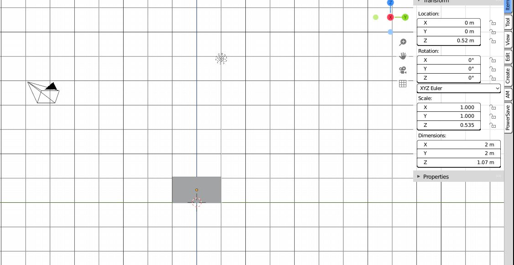

* Adjust your view so you can see the `Y` axis kbd:[MMB,DRAG] left to right (You can press "Y" in the axis gizmo on the upper right or use kbd:[KEYPAD 3]) 
* Adjust cube length to 12', (3.6576m) by using kbd:[S] kbd:[Y] and dragging, or by manually entering 3.6576 in the `Y` Dimension field 
* Switch to front view and adjust `X` width to 32" (0.8128m) kbd:[Keypad 1] then kbd:[S] kbd:[X] and kbd:[DRAG] or enter .8128 in the `X` Dimension field. 

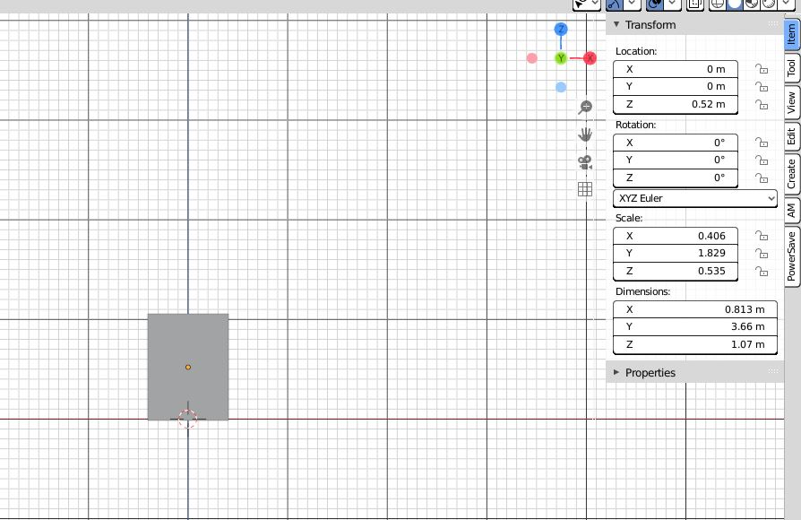

* Choose menu:Object[Apply Scale]

* With the `CUBE` still selected, switch to `EDIT MODE` using the kbd:[TAB] KEY. 

[NOTE]
We are doing this without worrying about EXACT dimensions just to keep things simple.  

* Add a `LOOP CUT` kbd:[CTRL,R] and slide it down ( `Z axis` ) to the grid line closest to the bottom, and add another `LOOP CUT` kbd:[CTRL,R] and drag it down to be 2 grid lines above the first one. 

* Add a final `LOOP CUT` kbd:[CTRL,R] but this time,  add it vertically.  It should end up dead-center by default.  

[TIP]
Drag the mouse around to get it to snap to a vertical loop.

image:images/JB2.JPG[]

* Go back to `SELECT` Mode by clicking the Arrow icon if its not already selected since we are done with `LOOP CUTS` for now.

[TIP]
In these next steps,  we will be using Vertex `EDIT MODE`. From the front view,  we will DELETE the vertices on the left side of the object because we are going to use the Mirror Modifier to create a symmetrical object.  

* Press kbd:[KEYPAD 1] for front view, and then kbd:[1] on the keyboard to select Vertex `EDIT MODE`. You should see the vertex dots on the selected object.  

[NOTE] 
You can also select the vertex mode with the screen menu.  Its the small square icon with a dot on one side next to the view tab. 

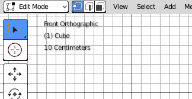

* Now use `BOX` select on the vertices on the left side with your mouse. (They will change to the SELECTED color)

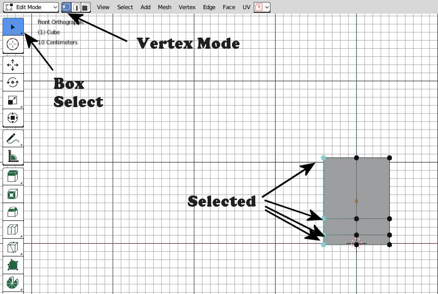

* Press kbd:[X] for Delete and in the pop-up window, choose to `Delete - Vertices`.  Blender will delete the selected vertices. Wait... What just happened?

It didn't perform a delete?   Oh my, yes it did, but not what we wanted!

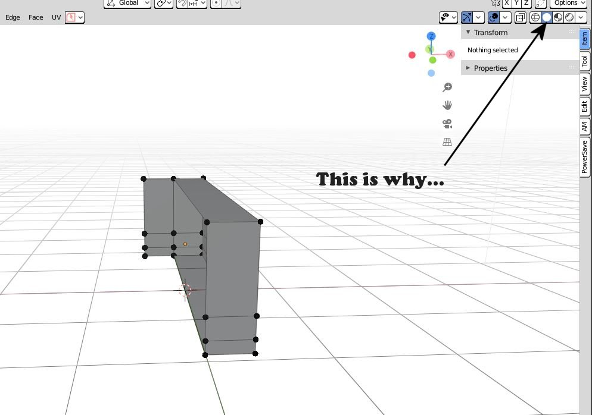

We are in ViewPort "Shading Solid" Mode.

[WARNING]
Do you understand what happened?  We only selected the FRONT facing vertices! We didn't touch the ones in the back. Press kbd:[CTRL,Z] to undo if you completed the above step. To select ALL of the vertices that we really want to select, we need to be in `XRAY/Wireframe` mode. To chose this mode, press kbd:[Z] and chose `WIREFRAME`, making sure that the viewport mode on the top right of the screen agrees. You can also toggle Wireframe mode by using kbd:[ALT] kbd:[Z]. The Circle with LINES in it and the `X-RAY` icon next to it should also be highlighted.

* Make sure you are in vertex select mode kbd:[1], and also in the front view kbd:[1] we will remove the left side vertices. Press the kbd:[Z] key and select `WIREFRAME`,  Press kbd:[Keypad 1], and then kbd:[1] on the keyboard to select front view & vertex mode. You should see your vertex dots and the model will look transparent now and not solid.  

* Now, `BOX` select the vertices on the left side, like before.  (They will change to the SELECTED color) and  press kbd:[X] and choose to Delete Vertices.  Blender will delete the selected vertices. Now, you will finally only see 1/2 of your object remaining.

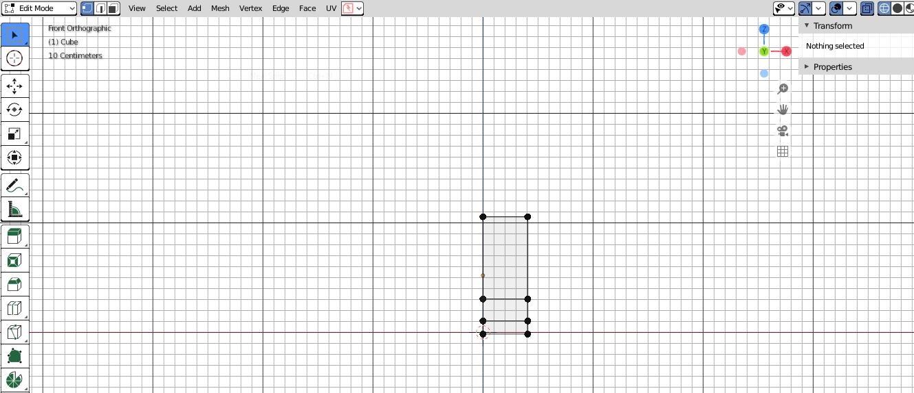

* kbd:[TAB] back to `OBJECT MODE` and with the current OBJECT selected, locate the `WRENCH` icon on the right panel on the screen. 

* From the `Add Modifier` dropdown menu, select `MIRROR` Modifier. You should see the section we deleted above come back into view since the `MIRROR` is using the `X` axis to mirror of the original object by default.  (See the Check Box that is already checked)

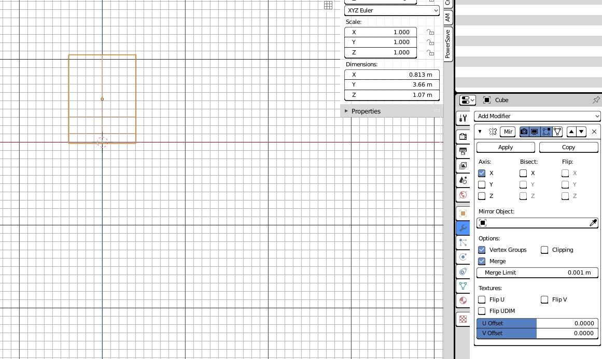

* `TAB` back to `EDIT MODE`.  Note that you should now only see Vertex dots on the right side of the object, but you will see the full shape with the mirrored side visible.  It's mirrored now, and whatever you do on the right side gets mirrored to the left side.

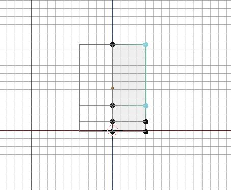

* Select the top 2 right side vertices and press kbd:[G] kbd:[X] to shift them inward until you get about a 55 degree angle.

* Repeat the same process with just the top right vertices until you get about an 85 degree angle.

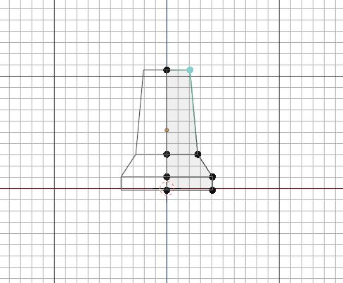

So now we have a basic shape of the concrete barrier.  The next steps will complete the shape.

[NOTE]
We can go back to `ViewPort SOLID` mode now.

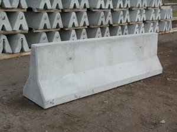

If we look at the barrier closely, we will see that the edges are not sharp.  They are beveled. So now we will use the Bevel tool. For this next operation, we no longer need the Mirror Modifier so we can Apply it.   

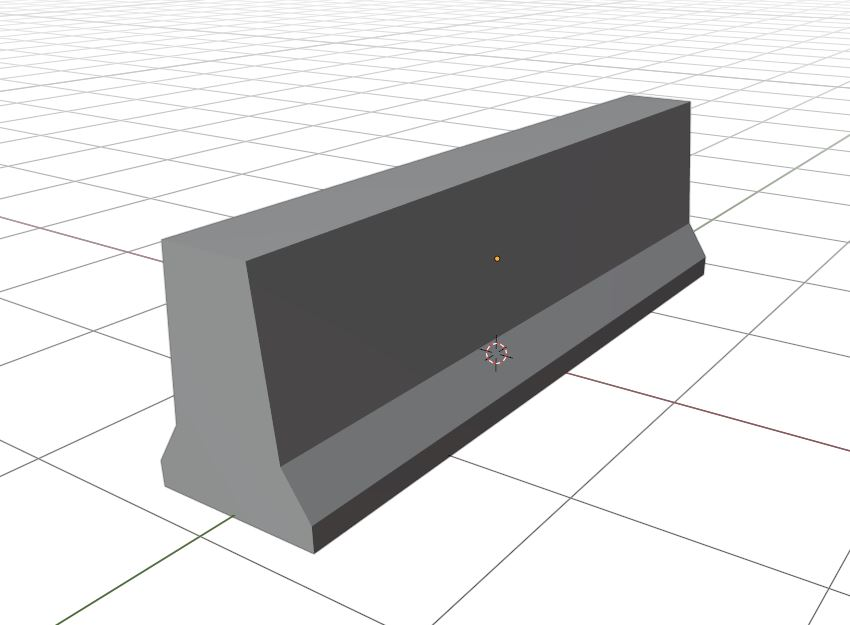

[WARNING]
The Apply button for modifiers was MOVED into the pulldown options in Blender version 2.9 and newer.

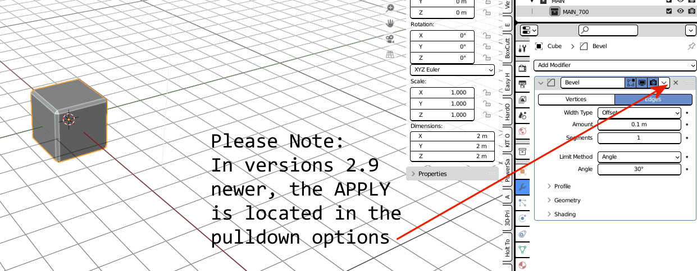

* Go back to `OBJECT` mode, select the `WRENCH` Icon and with our object selected, click `APPLY`. The modifier will apply and go away.

[NOTE]
When you apply a modifier, you lose the ability to adjust it further.  Prior to applying it, you can still make adjustments to the shape.  In our case, were were done with making a symmetrical object, so it was `OK` to apply the modifier. 

* Now, kbd:[TAB] back to EDIT MODE and select the EDGE select mode with kbd:[2] key.   

* We will select the visible edges of the shape.  You will need to `SELECT` multiple `EDGES` so here is what we will do. Hold kbd:[SHIFT] then select the TOP LEFT Edge, you will need to shift your view with the kbd:[MMB] to get a good viewpoint for selection. The TOP EDGE will be selected... Now click the remaining "outside" edges while still holding kbd:[SHIFT]. 

[NOTE]
This creates a selection group. If you left click an edge again without holding kbd:[SHIFT], you will lose the selection group and will need to reselect all the desired edges again. 

[TIP]
If you hold kbd:[ALT] + kbd:[SHIFT] you will select all connected `edges` at once.  It often will select more than you actually need, so you might need additional kbd:[LMB] to unselect unwanted edges.

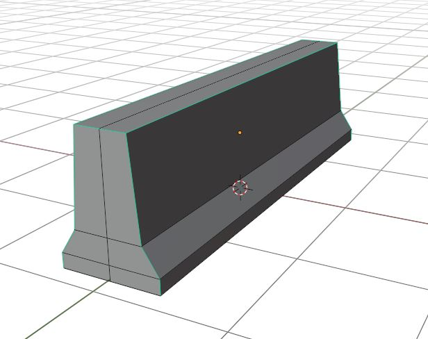

* Press kbd:[CTRL,B] to use the BEVEL TOOL. and adjust the offset to be about 0.02 and Left Click the mouse to accept.

[NOTE]
I am aware that I could have left the modifier on during the BEVEL operation.  I did not this time because it is good practice to rotate around a model and select specific edges manually.

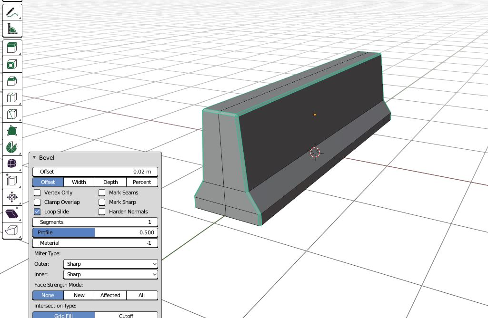

Here is what we have now after the bevel operation.

image:images/BevelResult.JPG[]

If we look at the object back in OBJECT MODE with the Solid Viewport Shader, we see this. 

<<<

=== Texturing

The goal with texturing is to be able to apply a 2 dimensional bitmap to a 3 Dimensional object. Its rather tricky and there are multiple ways to do it.  The easiest is to just `Mark Seams`` and then UNWRAP the object, then moving the resulting `UV Islands` into position on your bitmap. 

[NOTE]
While I say it is the easiest way here, that is a bit misleading.  Sometimes, using the `Mark Seams` and `Unwrap` steps create more work for texture creation than is reasonable.  Especially if the object is complex but non-organic, like a Boxcar, Engine or Building. 

For the texturing  steps, we will use a 512x512 texture that looks like this:

image:images/TextureSet.png[]

==== Let's Begin Texturing

`Marking Seams`:: You would Mark Seams (Edges) where the flat edges stop and in the case of our Jersey Barrier model, we mark TOP, BOTTOM, FRONT, BACK and both SIDES by selecting all relevant edges and then use `EDGE->MARK SEAM` to define seams.  These will now highlight in the SEAM COLOR.

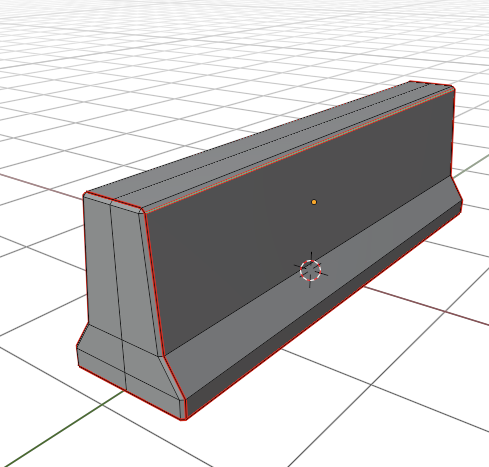

* Make sure you are in `EDIT MODE` and select ALL parts of the object by pressing kbd:[A] and then change your `WORKSPACE` tab to `UV EDITING`. (Top of the screen) 

* You will now have your `EDIT` window and the `UV EDIT` window on your screen. Also, you might see the UV UNWRAP of the default cube... which is not what we want.

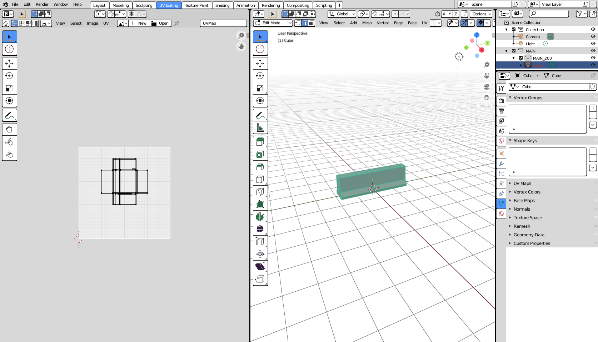

* In the `EDIT MODE` window select  the `UV` tab , or press kbd:[U] and then chose `UNWRAP`. 

[WARNING]
If nothing happens in the left `UV EDIT` window, you probably didn't have everything selected. 

* Now, before you do anything else, locate the `UNWRAP`  tab that showed up at the bottom of the screen and adjust the `Margin` to be a value of 0.05 or 0.08.  The default value 0.001 is just too small for our needs. This will give a greater separation between te generated UV Islands.  we will want to move them around.

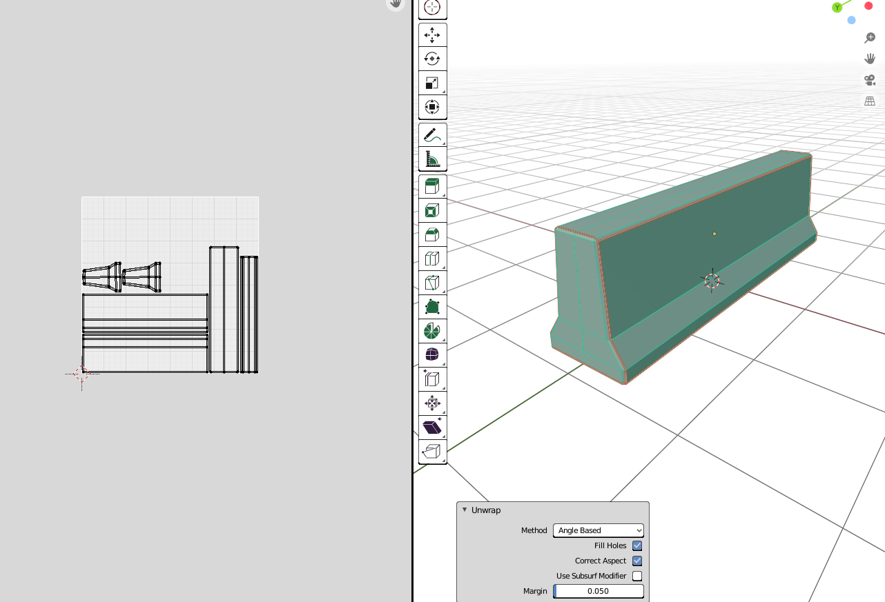

* Give your model a new material. In the `PROPERTIES` window on the right side, locate the sphere with a grid inside it near the bottom of the Properties window.  That is the material panel. 

[TIP]
====
To create a material in Blender, you can use the Material tab in the Properties panel. In the Material tab, you can specify the material's color and texture, as well as adjust its properties such as specular intensity, roughness, and transparency. You can also use the Shader editor to create more complex materials using nodes.

Once you have created a material, you can apply it to an object in your scene by selecting the object and then clicking the "Assign" button in the Material tab. The material will be applied to the surface of the object, and will be used to determine how the object appears when it is rendered.

Materials are an important part of creating realistic and visually appealing 3D scenes in Blender, as they allow you to control the appearance of objects and surfaces in your scene
====

* Your object likely received a default empty material. Let's update it.  Under `SURFACE PROPERTIES`, Click the small circle on the left side of the `BASE COLOR` field.  You will get a list of options.   

* Choose  `Image Texture` and we will thhen locate the Concrete texture we will use. (You can create your own or use the one I created for this)  You should have some texture file ready in advance.

* Under `BASE COLOR` you now see `+NEW` and `OPEN` icons.  Click `OPEN` and chose your existing texture file. The `UV SQUARE` background image in the UV Window should now display your image behind your `UV ISLANDS`.  If you choose `NEW`, you will have a blank image assigned to the material, which in this case is not helpful.

[NOTE]
The GITHUB page has a DEMO1.ZIP file that contains the concrete texture I used.

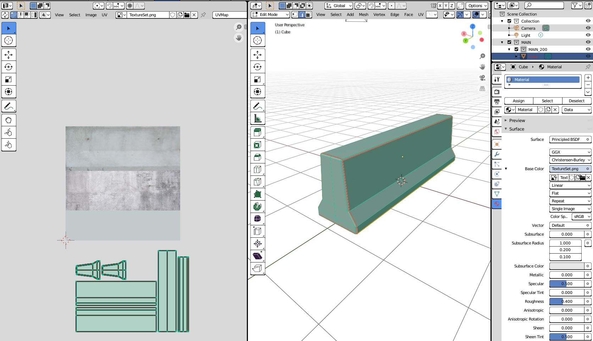

* The task now is to arrange the UV ISLANDS (Using the standard tools kbd:[G] kbd:[X],  kbd:[G] kbd:[Y] keys as well as resizing with kbd:[S] and rotate with kbd:[R] )  You can temporarily shift islands outside the 1x1 UV SQUARE, but by the end of this process, all of the islands will need to be back within the 1x1 texture space.  

[TIP]
When editing UV Coordinates, the `X` axis is left-right and the `Y` axis is up-down.

* Because we added some space between islands, they should be much easier to grab, rotate and place on the background. I recommend moving ALL UV islands outside the space and moving them back in 1 at a time.  If you enable the `Double Arrow` icon in the `UV WORKSPACE`, updates will be reflected in both workspaces so you can see what you are doing in real-time.

* You can select faces in the `EDIT` window to isolate them in the `UV` window or use the kbd:[L] key to select linked faces.

* In this specific case, we will overlap the Left and the Right Side on the same texture space.  When appearance is not critical, this works out just fine. Unlike 3DC, there is no "paint" with defined UV coordinates option.

What I ended up with is shown below.  Yours will likely be different based on what you marked as seams and how you laid out the islands. Again, its not critical with this type of model.

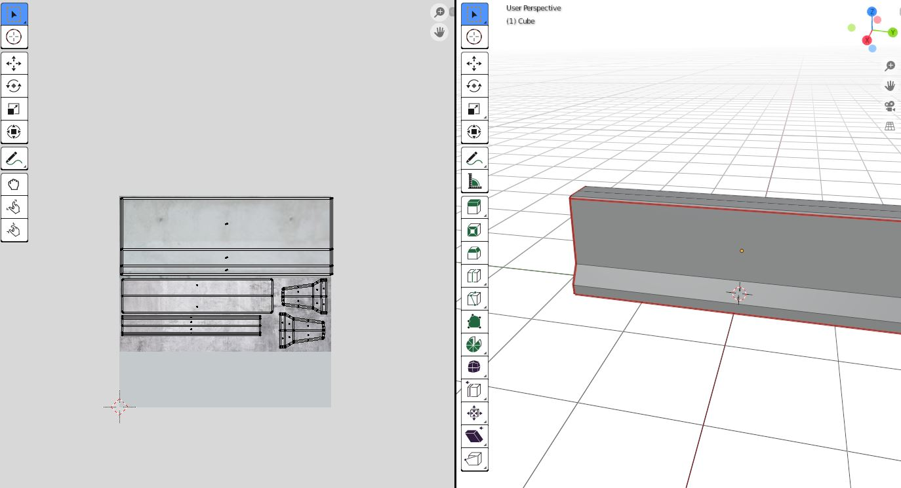

* Now we can return to the main modeling workspace and then change the viewport shader to Material Preview mode.  

MATERIAL PREVIEW
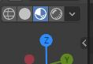

We now see the object with the material applied.

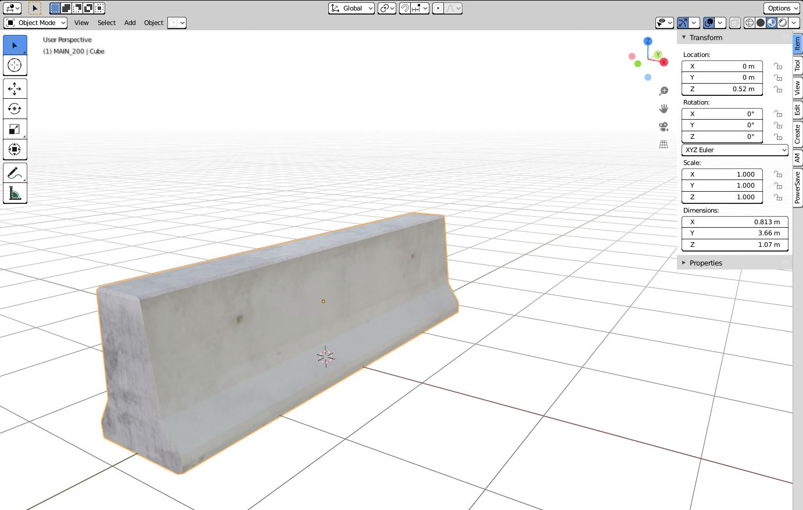

This model is now ready for the MSTS exporter.

(((Texture, "Shader Properties")))

[NOTE]
====
The MSTS Materials shader properties provided by the exporter follow the standard material options available in MSTS:

* Solid – A material that is using an opaque texture only.

* Trans – A material that is using a transparent texture only.

* Alpha – A material that is using a semi-transparent texture only.

* Specularity – A lighting highlight effect that gives the illusion of shine.

* Gloss – A material that is using a glossmap, which is an artificially created reflection.

* Cruciform – A tree shape that requires it’s own material so that it can prioritize with the terrain and the surrounding objects.

* FullBright – A material usually assigned to the inside of trains so they never get dark.

* HalfBright – The same as full bright but at half the intensity.

* Dark Shade – The opposite to full bright, it reduces the overall intensity of light.
====

In `OBJECT MODE`, under the Materials property panel, scroll down to the bottom to where the MSTS exporter section is, titled: `MSTS Materials`.  

1. Update the `BaseColorFilePath` (using the Folder Button) to select the texture of the highlighted object we have been working on. 

2. Now switch to the `SHADING` window using the top menu bar.  Note: that the `NODES` window now has a `UVMap` node and the text field says "UVMap".  This is needed for the MSTS `S` file export.

3.  With this verified, you can now use the MSTS exporter.

* Chose menu:FILE[EXPORT > OPENRAILS/MSTS(s)] file, and choose where to save. Use the browser to select your project's `\final\` folder and modify the filename as needed...  I chose `barrier.s` for example.  The bottom of the screen will say "Finished OK" when done.

[NOTE] 
The exporter will ONLY create the `.S` file and by default assume your texture is `.ace`.  Converting your `TGA`, `.JPG` or `.PNG` textures to `.ACE` (or .`DDS` ) remains for you do as you will need to do this manually ourside of Blender.

For a sanity check... edit your exported `.S` file with a unicode editor to make sure your texture reference is correct.

[TIP]
Version 4.4+ of the MSTS EXPORTER includes a button to define the textures used in the `.S` file as `.DDS` instead of `.ACE`

----
 images ( 1
        image ( TextureSet.dds )
    )
----

(((Texture, "About DDS")))

[NOTE]
====
ABOUT DDS SUPORT 
With a master texture file, in a `PSD` format for example,  and using PAINT.NET to keep the layers intact, you cave save it from PAINT.NET as a `.DDS` file natively.   As a result, a minimal amount of after-the-fact editing is needed.  To work in Blender, save a copy the master `PSD` file as a `PNG` file and to work with in Blender. Then save a copy of the master `PSD` file as a `DDS` file.
====

[IMPORTANT]
Again, the Exporter script  will *only* create the model `.S` file.  You still need to create all the final textures and the ENG or WAG or similar related files that define your model to the simulator.

The final step would be to copy the contents of the project's `FINAL` folder into the {or} `trains` content folder for testing.  

=== Creating Level Of Detail Distance levels

(((Blender, "Considering Level Of Detail")))

Once you have your main model created, you should consider creating Level of Detail or "LOD" entries.  These are easy to add or change by editing LOD collection name, eg create MAIN_0500 or rename MAIN_0700 to MAIN_0500. You add content to a new LOD level collections by dragging parts around or using the M key to assign collections. With collections, all your LOD assignments show in the outline panel and you can hide or un-hide whole collections as needed since your LOD assignments are also clearly shown in the object’s 'Collection' panel.  Making use of the filter options and checkboxes of the Outliner helps to focus your work.

Blender WILL rename your parts when you add them to a new LOD, but the MSTS exporter is looking at the COLLECTION and BASENAMES of the objects, like WHEELS, which means you won't need to rename entries that suddenly have 001 appended to their name.

You can select a group of objects in the Outliner by using the kbd:[SHIFT-LMB] to copy multiple items at once to a new COLLECTION.  It would be good to experiment with the Outliner filter options so you are aware of what is available.

==== Guidelines for creating LOD versions

Level of Detail of versions of a base model are determined by how much detail is visible based on the distance the camera is from the camera (or player view).  When your camera is very close to an object in {or}, then you want to see the maximum detail available.  As your view of an object becomes far away, there is no reason to display the full detail of the object as much of it will be hidden or to small to see. The reduced polygon models (LODS) will increase graphic performace by reducing the amount of drawing that needs to be performed by the graphics card.   For example, your main model might have 2000 polygons, but at 750 meters, you might only need to display 200 polygons and at 3000 meters, you might only need to display 50 or so polygons to get the same overall effect.

You define your intentions for each level of detail in your outliner.  As explained earlier, you define your LODS using a naming convention under the MAIN collection where each lod distance setting is part of the sub-collection name, for example:

|===
| NAME      | DEFINITION

| MAIN      | MAIN COLLECTION
| MAIN_0500 | 0 - 500 meters
| MAIN_1000 | 500 - 1000 meters
| MAIN_2000 | 1000 - 2000 meters 
|===

----
MAIN
    MAIN_0500
         BODY (20,000 polys)
         BOGIE1 
            WHEELS11
            WHEELS12
         BOGIE2 
            WHEELS21 
            WHEELS22
         etc

    MAIN_1000
      BODY (3000 polys)

    MAIN_2000
      BODY(200 polys)

----

[TIP]
You can use the DECIMATE operation in Blender to quickly reduce the polycount of a shape while maintaining most of the topology of the original shape.  This can give you a head start on reducing what gets drawn on each LOD level in additional to just removing the finer details that won't be seen. 

<<<

=== Building a Library of Reusable Parts

This section mainly applies to users who still use a version of Blender prior to version 3.0.

[TIP]
Blender 3.0+ has a new Asset Library feature where you can store pre-made objects and textures that are shared among your projects.  A perfect place to store various pre-made Bogies, Couplers and other common objects. In fact, this is one of the best reasons to consider upgrading to 3.0. 

It is common to see regular parts used multiple times in a single design.  Handgrips, railings, wheels, trucks etc are often regularly available parts purchased by Rail Vehicle companies as commodity items. In the same way, we should not have to keep making the same parts over and over again.

One way to accomplish the re-use of the common parts is to `duplicate` one with kbd:[SHIFT,D]. A selected part will be duplicated and ready for a location transform to move it to a new location. This is easier to manage after you have completed the UV-Unwrapping of the object.  All duplicated parts will share the same UV MAP locations so if you need them to have different mapping, its a matter of shifting them around in the UV Editor.

[WARNING]
You should not use kbd:[CTRL,C] and kbd:[CTRL,V] to duplicate objects as an alternative to kbd:[SHIFT,D] because the standard copy/paste operation will make new copies of everything, including Materials.  So your MAIN texture would become MAIN001, MAIN002 etc on each copy/paste operation.

[TIP]
====
A particularly nice add-on for Blender, if you are using a version older than 3.0,  is "Asset Management". Yes, I know,  it costs $40, but I don't regret it.  I don't even use all of its features.  It does let me export objects into an asset library. It creates a thumb-nail of object to assist with locating the item in the future from a grid of object pictures.  When you select an object from Asset Management, it will be inserted into your project.   

https://Blendermarket-production.herokuapp.com/products/asset-management  

This add-on has been made somewhat redundant now that Blender 3.0+ comes with an Asset Browser but it does still work in version 3.0.
====

=== A Brute-Force Library solution

A simple and rather easy way of creating a collection of re-usable parts is to *COPY* and *PASTE* specific parts, adding them from your current file to a library specific `.blend` file. It does require that you have 2 copies of Blender running.

* Save your current project, just in case.  

* Highlight the object you want to export to a library file, but first make sure you set the origin to object geometry. menu:View[ OBJECT MODE > OBJECT > SET ORIGIN > ORIGIN to GEOMETRY]

* To copy,  press kbd:[CTRL,C]. The object will be copied to a system buffer. 

* Open a _fresh instance of Blender_ so you have 2 blender sessions running, clear out all unwanted default items from your new scene and press kbd:[CTRL,V]

* The copied object(s) from your first Blender session  will be placed in your new blend file. Copy as many objects into this file as you need. It is best to avoid overlapping them. 

image:images/lib1.jpg[]

* Save it now with a name that refers to the new object library you are making. Example: `Library_Freight.blend` (Don't skip this step) 

* Now the tricky bit, open a *NEW GENERAL Blender FILE*

* Choose menu:FILE[DATA PREVIEWS > BATCH GENERATE PREVIEWS] and chose the file name you used in the prior steps. Example: `Library_Freight.blend`

[NOTE]
This will take a few moments and will eventually present you with a console screen when complete. By doing this, we are telling Blender to create Object Icons in the saved file.

* In the future, you just need to use menu:FILE[APPEND] option to insert the object into your current projects, but, the bonus is that you can select them using the `THUMBNAIL` view option in the `FILE APPEND` menu,  so now you will know which part you are appending to your current `blend` file in a visual way.

* Choose append ans select `THUMBNAIL` view you will see file menu. 

* Choose the library file you saved

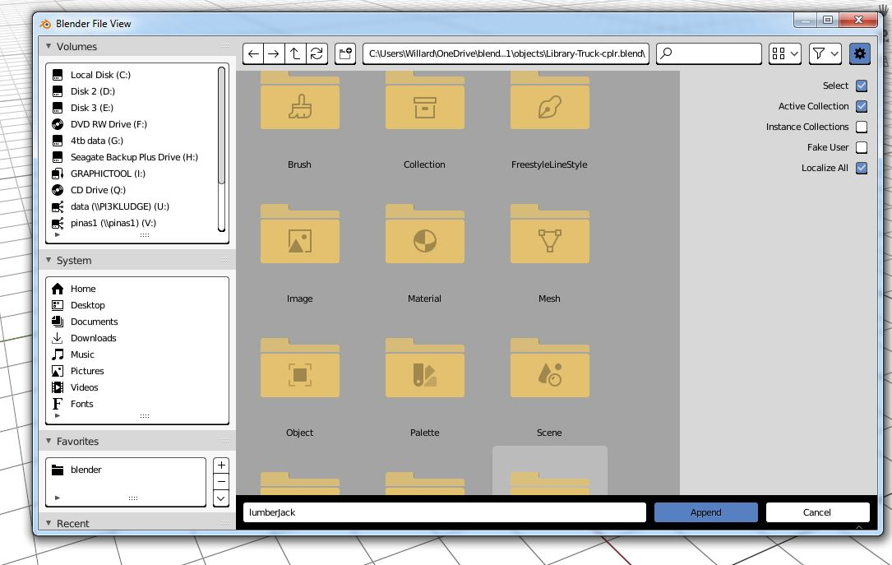

* Choose OBJECT folder and you will see ICONS of the parts in the file. Select one and it will be appended to your current file.

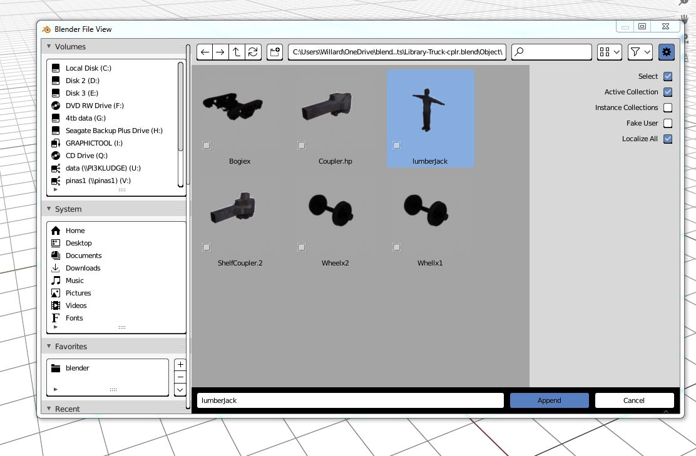

When using this technique for an object library or multiple object libraries, you should to consider your file structure because when you build up a repository of `.blend` files it can become confusing when searching for a specific item later on. Using a well planned and organized file structure is better than having files all over the place or all in a single bucket.  

It might mean that there are some redundancies in your files in the long run, but consider populating the OBJECTS and TEXTURE folders of each project local to that project versus using a master folder for all projects.  This way you can make folder-relative reference to files and you have the ability to move folder as well as share with others without breaking Texture file references, for example. 

Another somewhat flexible option is to export your selected parts as an FBX or Collada (DAE) files.  These can be imported later with a `File-Import` process but it also means that you have something that can be imported to other applications as well.  The main difference with this option is that these are no longer native `.blend` files and there could be some mangling of contents when being imported back into Blender.

[TIP]
For the curious, 

[NOTE]
A file structure that I often use for individual project folders is shown below:

----
<project>
<project>\final
<project>\mesh
<project>\objects
<project>\textures
<project>\tmp
<project>\reference
----

[TIP]
I would store any `local` object library collections created with the COPY/PASTE method under `\objects` folder.  There is a handy tool available https://www.dcmembers.com/skwire/download/text-2-folders/  "Text2folders", that makes creating this consistent folder structure easy.  Just replace the text "<projects>" with the name of your current project and pass this text file to the "Text2folders" application and it will create all the folders for you.  It can even do sub-folders. 

[TIP]
Keeping the Part Library and Texture files available under the current project structure is helpful if you share your modeling content with others, provided you have the available disk space to allow duplicates in multiple project folders.  It also allows for small tweaks that are specific to a project.

[TIP]
If using the `Asset Browser` feature of Blender 3.0, you would use the menu:3D View[ Object > Asset > Mark as Asset].  Then, `Save the file` in your ASSET folder,  otherwise your asset edits won't be available to other files.  This is why it might be better to create specific library collection `.blend` files to be stored in the asset folders.

 

==== Importing Existing Objects

(((Blender, "Importing")))

Importing shapes from other 3D Software can be a bit tricky and there are numerous reasons why.  I will try to outline a few basic steps and possible pitfalls that can be avoided.

*  Imported shapes often get renamed with a `S_` prefix when using Blender importers which might require you to to rename your objects in the Outliner.

*  When your source objects are in a Autodesk `3DS` file format, which is pretty common, you need to cope with the fact that, for some reason, Blender 2.8+ dropped support for it. 3rd-party software like 3D CANVAS or some online converters can do the conversion for you.  

[TIP]
You can also run multiple versions of Blender side by side. Blender version 2.79 still supports importing and exporting `3DS` files and it is a simple as importing a `.3DS` file into Blender 2.79, perform a `Select-All` and `COPY` and then `PASTE` into your current Blender 2.8 session.

[NOTE]
As of version 3.6 LTS, Blender once again supports importing of 3DS files.

*  UVMapping can survive an import operation... but material and texture selection probably didn't. 

* The import step has also probably has assigned a new material for each object and to be honest, it's easier to manage if you have all objects that use the same texture also use the same material (unless you need special alpha or reflective properties for something like metal or glass). 

* You also will probably need to manually tell the `S` file exporter (under MSTS Materials) where to find the texture file under the `BaseColorFilePath` input field.

* Lastly, from personal experience, if you are importing a `DAE` (Collada format) file from say `3DC`, you might encounter an issue with `UVMAP` assignment in `SHADER EDITOR` where you are not getting the right `UV map` assigned and you see no texture in the `Material Preview` mode  (Commonly called `LOOKDEV` mode).  

This the second tab from the right in the viewport selections. Everything will LOOK right in the `Material Preview`, but exports will fail with a "Missing UVMAP in:" error when you try to use the `S` file exporter.  _See the next section for how to deal with this problem._

Material Preview 

==== Fixing UV MAP Assignment Issues on Imported Objects so they work with the MSTS exporter

[.lead]
Each mesh that you export must have a uv map named `UVMap`.

[NOTE]
Since `UVMap` is the  *default* name assigned by Blender for new `UV MApping data`, if you create everything from scratch, you won't encounter the problem when you export. 

The mapping reference of `UVMap` is the only map that will get exported to an `S` file by the MSTS exporter.  When using the `DAE` importer, for example, you might end up with a `UVMap` that is referenced using an object name from the time of importing.  

There are some other cases where this could be an issue, for example:

* An advanced user may have multiple uv maps with other names assigned. ( eg layered shaders, baking, etc )
* When importing a mesh from some other program it may come with different `uv map` names
* Some non-english versions of Blender may use a different default name.

You could check or try modify the name of a `uv map` like this:

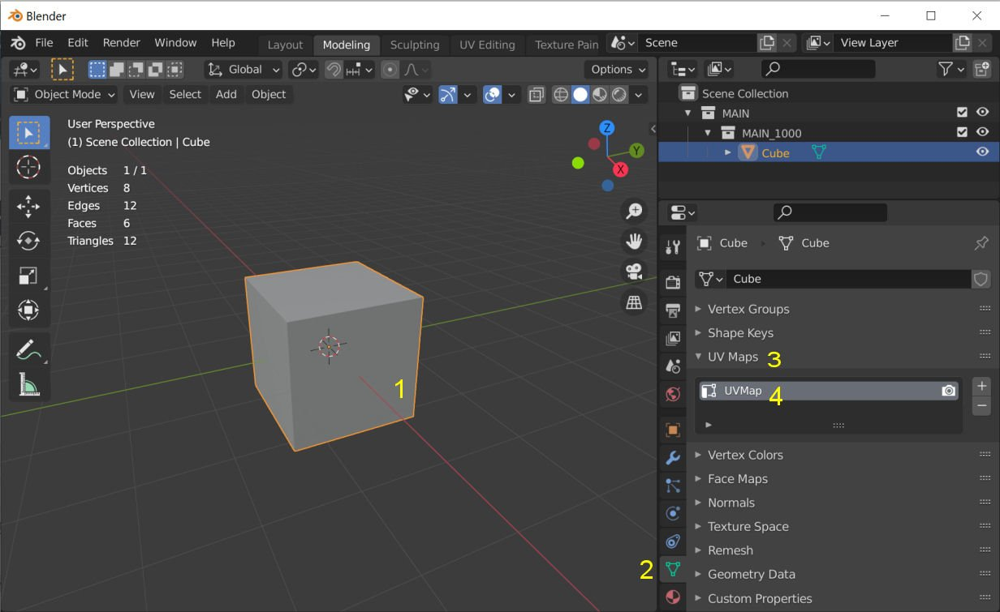

1. kbd:[LMB] Click on your mesh object.
2. Select the `MESH PROPERTIES` tab.
3. Open the `UV Maps` panel.
4. Double click on a `map name` to change it to 'UVMap'

There is a tested script that will do this for you.

(((PYTHON, "FIX UV MAP")))

[source, python]
----
import bpy

for mesh in bpy.data.meshes :           # for every mesh in the .blend file
    if len( mesh.uv_layers ) == 0:      #   if it doesn't have any uv maps
        mesh.uv_layers.new()            #   create one, if it doesn't have one 
                                        #   with the default name    
    if not mesh.uv_layers.get('UVMap'):
        firstmap = mesh.uv_layers[0]    #     rename the first map
        firstmap.name = 'UVMap'         #     to the default name
----

To use this code: 

* You would select the `Scripting` Tab and kbd:[LMB,CLICK] the NEW option to get a new edit window. 
* You would copy and paste this code snippet into the text editor window. 
* Last, you would press the "RUN" arrow icon in the file window menu to run it.

It will fix the UVMAP naming on all objects for you.

== Model Exercise #2

=== Intermediate Modeling 

Key items to take away from exercise #2

* Interiors
* Glass
* Texture preparation

* Back Ground Images

==== Building the General Shape

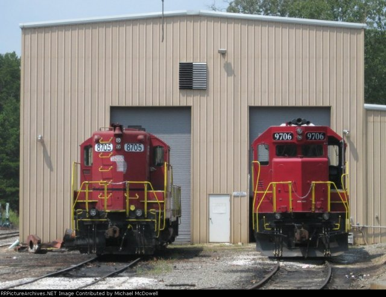

Let's say we are modeling a building.   I'm thinking... 2 stall engine house  40' x 80', and 20' tall with two 12'x18' garage doors and standard metal door with an office window.

I will use this for a background image.
image:images/40x80x20.jpg[]
Apologies for the terrible image. These are somewhat hard to find.

=== Importing the Background Images

[NOTE]
Much of my previous content was created using Amabilis 3D Canvas modeling software. It was rather difficult to create and use good background images, so I seldom used this method.  With Blender, the process is much easier and I highly recommend it. 

[TIP]
You should pre-determine the center-point of each view and align them with the axis lines in Blender.

(((Blender, "Importing Background Images")))

If you can find blueprints of at least the front/back and side view, you are all almost all set to use them as backgrounds.

If your blueprint is black and white, you might consider modifying it to be a negative image with the background as black and the convert the background to clear alpha.

In the "LAYOUT" workspace (in the top menu) in ``OBJECT MODE`` select SIDE VIEW  (KEYPAD 3).  
Use the ADD  -> Image -> Background menu tree to load in your side view image.
Select FRONT VIEW (KEYPAD 1) and then ADD  -> Image -> Background menu tree to load in your front view image.

[NOTE]
By default in Blender 2.8x, you will only see the Side or Front background images when in front ortho or right ortho view.  The images will go away when you pan around your model. This is a setting in the Data Properties of the Background image object.

==== Setup
Use the file structure that was outlined earlier.

----
twostall
twostall\final
twostall\mesh
twostall\objects
twostall\textures
twostall\tmp
twostall\reference
----

* Add the Background image to `reference` folder

* Adjust the default cube Dimensions to be 40x80x20  (X=12.192, Y=24.384, Z=6.096). This will be the basic shape.

* Apply the scale with `OBJECT->APPLY->SCALE`

image:images/ex2_1.JPG[]

* Save the `twostall.blend` file under `twostall\mesh` folder.

* Switch to front view kbd:[KEYPAD 1] and select `ADD->IMAGE->BACKGROUND` and chose the image from `twostall\reference` we saved their earlier.

* Position and scale it to match the basic shape, but not the roof.

Now, it might seem intuitive to just use the basic outline we have now, insert a `loop cut` on the top and shift the top vertices upward to make the  roof shape.  Here is why that is the hard way. You won't have a roof overhang and all roof edges have an overhang.  We will instead shift the current shape so it is only as tall as the roof overhang.

* Press kbd:[TAB] to reach `EDIT MODE` and kbd:[1] for vertex select and kbd:[Z] and select (WIREFRAME).
* Add a vertical `Loop Cut` kbd:[CTRL,R] in the center.
* `BOX` select the bottom vertices and shift kbd:[G] kbd:[Z] to be about the right height for the roof overhang. 

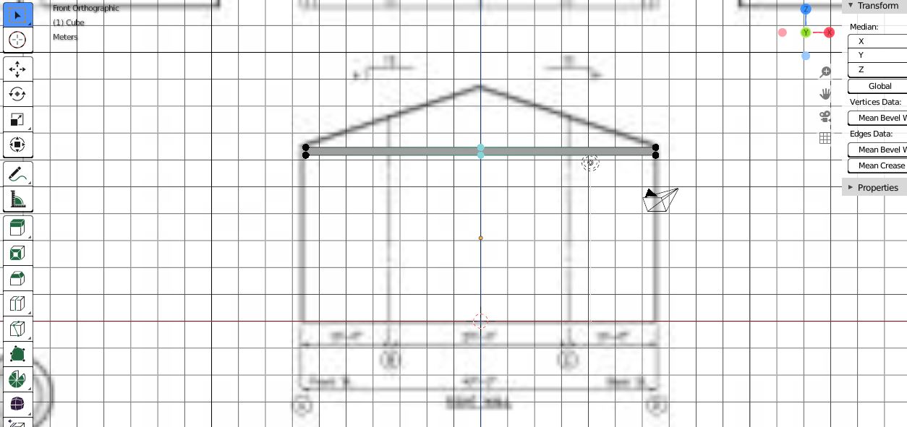

* Use `BOX` select to chose the central vertices and shift them upward to match the roof angle, kbd:[G] kbd:[Z] 
* Switch to Face mode, kbd:[3]

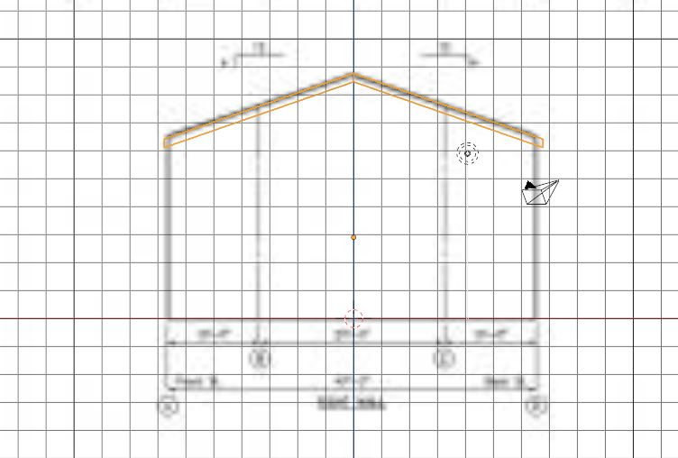

* Shift your view to be looking to the underside of the roof shape.

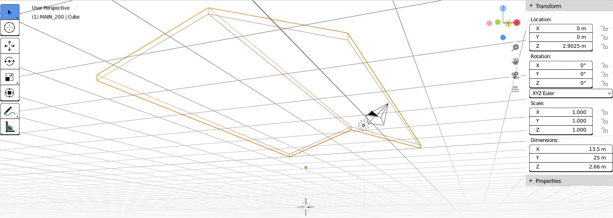

* Select the underside faces and use kbd:[I] to inset the selected faces to the amount of overhang that looks right.

image:images/ex2_6.JPG[]

* With these inset faces still selected switch to front view kbd:[KEYPAD 1] use the Extrude option kbd:[E] kbd:[Z] and drag the inset faces to ground level using the central vertices as a guide. Note: I used `solid view` mode for clarity. 

image:images/ex2_7.JPG[]

[WARNING]
ONLY the middle vertices will reach the ground, as the side vertices still have the roof angle and will temporarily dip below ground.

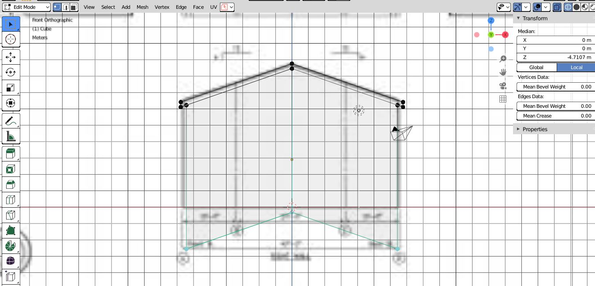 Some what hard to see, sorry

* kbd:[ALT] kbd:[Z] to toggle WIREFRAME mode on.  Using `Wireframe/X-Ray mode`, switch to *vertex edit* mode with kbd:[1] and select all of the bottom vertices. 
* Type: kbd:[S] kbd:[Z] kbd:[0] to flatten out the vertices on the bottom. 

[TIP] 
kbd:[S] `X`,`Y` or `Z` kbd:[0] is a nice magical incantation to remember to align vertices to a specified axis

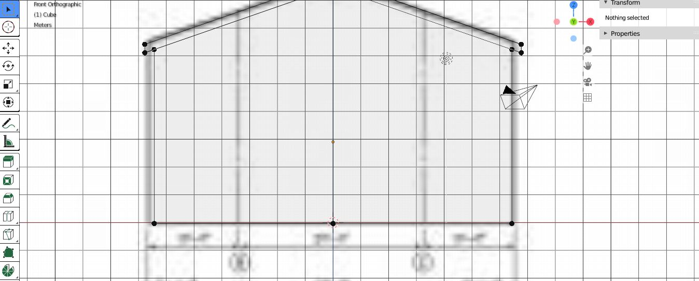

* While still in front view ( kbd:[KEYPAD 1] ), Shift all of the bottom vertices back to ground level with kbd:[G] kbd:[Z] as needed  

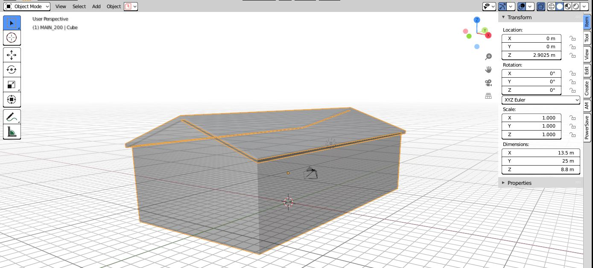

* kbd:[TAB] back to `OBJECT MODE` and use Solid View, kbd:[Z] and select (SOLID), to view the result in greater detail.

===== Making the Interior

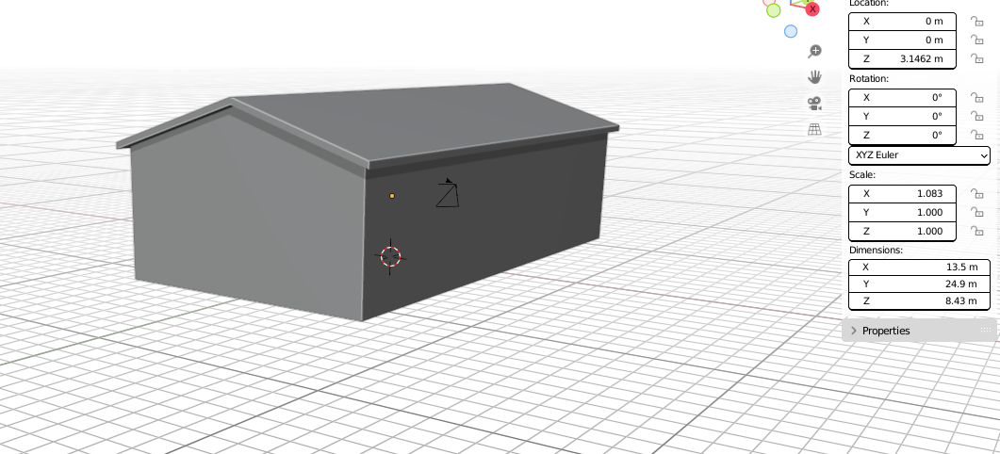

Now we need to give the building an interior.

* Shift your view to be below the model.
* Select the building and press kbd:[TAB] to enter edit mode (Unless you were already in edit mode)
* Chose X-RAY mode by clicking the X-RAY button on the top right or kbd:[ALT] kbd:[Z] 
* Press kbd:[3] to use face selection mode and chose the bottom faces.
* Press kbd:[i] to Inset and adjust until you get a realistic wall thickness and press [ENTER] to accept.
* Press kbd:[keypad 1] for front view and then kbd:[E] kbd:[Z]to extrude upward into (but not through) the model.

Note: The top of the inside of the model will be flat like the floor.  

To make the roof match the top roofline and staying with the front view mode...

* Press kbd:[1] for vertex selection mode and then box select the middle vertices on top of the inside being cut out.
* Press kbd:[G] then kbd:[Z] and drag the vertices up to match the angle of the roofline. 

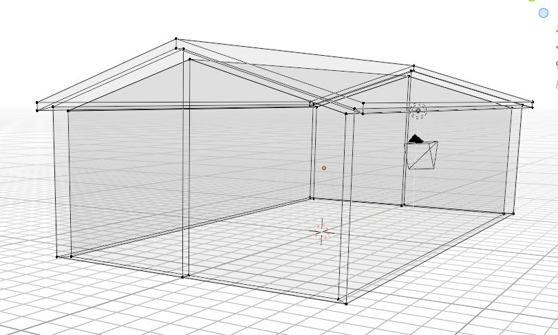

===== Making the Doors

To make the main doors, we will use a boolean cutout method to remove the shape needed for door access.

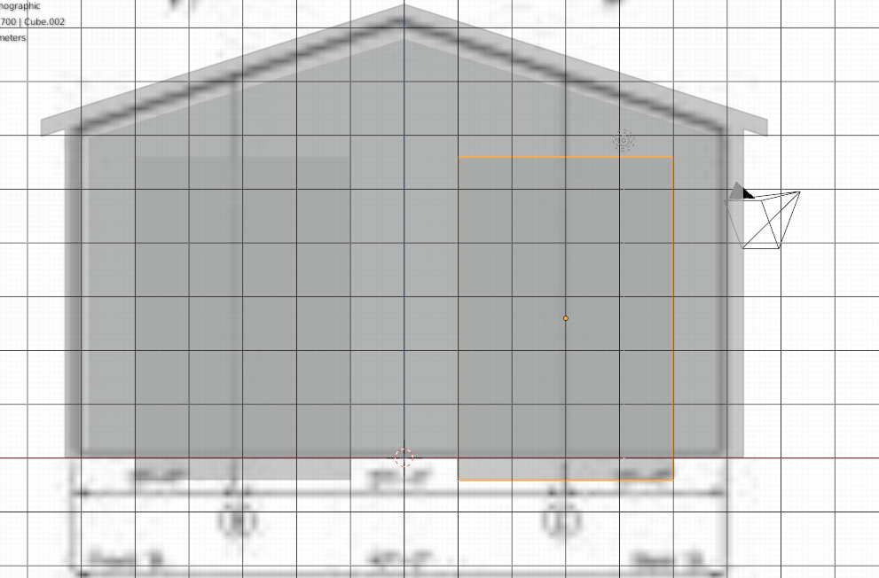

* Create a cube and resize it to: `X = 4m  Z = 6m` using the dimensions fields in the N-Panel (press kbd:[N])
* Move the cube so it's X position is -3m.  kbd:[G]kbd:[X]`-3m`
* Move the cube so it's Z position is 2.6m.  kbd:[G]kbd:[Z]`2.5m`
* Duplicate the cube: kbd:[SHIFT] kbd:[D] and set its X location to `3m`
* Select BOTH cubes and press kbd:[CTRL] kbd:[J] to join them
* Make sure you are in Xray mode: kbd:[ALT] kbd:[Z] and top view kbd:[Keypad 7]
* Move the joined cubes along the Y axis until it intersects the front wall from both sides. kbd:[G] kbd:[Y] or set Y position to about `-12.3xx`
* Select the Building object and use the modifier panel (wrench) on the right side of the screen.

image:images/door2.PNG[]

* Chose `ADD MODIFIER` and select Boolean
* Make sure boolean option is set as `Difference` and click the EYEDROPPER icon

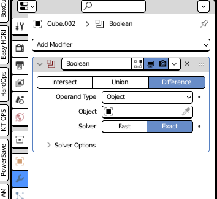

* With the EYEDROPPER, select the cubes we just created to make the door shapes. Since we won't be adjusting the door frame further, you *could* apply the modifier and we will see the new cutouts for the doors.

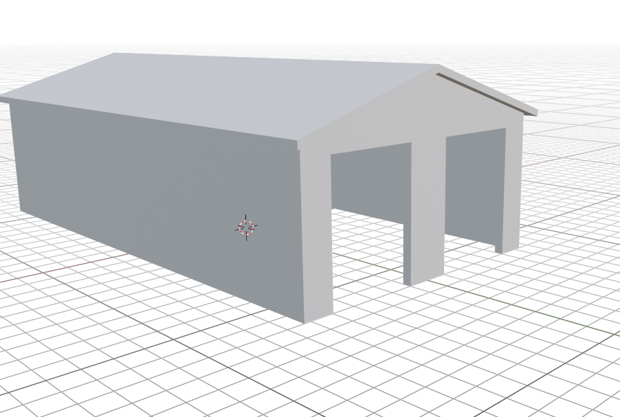

[TIP]
Moving multiple objects at once using the transform panel makes use of the kbd:[ALT] otherwise you are only able to move objects individually.

Example:: Moving (transform location)  ALL SELECTED objects at once.

(((Blender, "Move selected objects")))

Setup: 

* Select a primary object in the group of objects that you want to move as a group.
* Press kbd:[SHIFT] kbd:[S] for the PIE menu and "Set Cursor to Active"
* Select ALL of your objects you want to move together and use menu:Object[Origin>Set Origin to 3D Cursor]

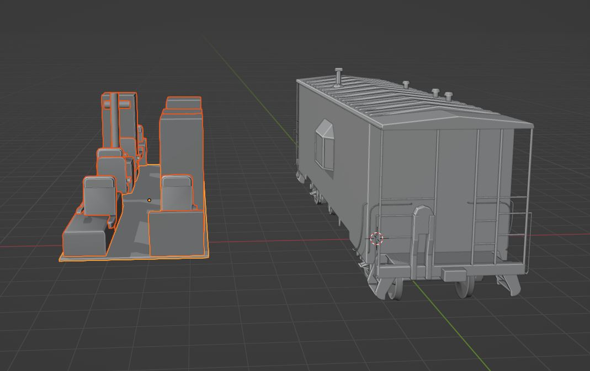

* Press kbd:[SHIFT] kbd:[S] for the PIE menu and "Set Cursor to World Origin"
* Now, lets say you wanted to move all of the objects to 0 on the X axis.  Using the Transform > Location panel for X value input, HOLD  kbd:[ALT] and key on "0" in the field.
* All of the objects should have moved to X = 0 location in the 3D View together.

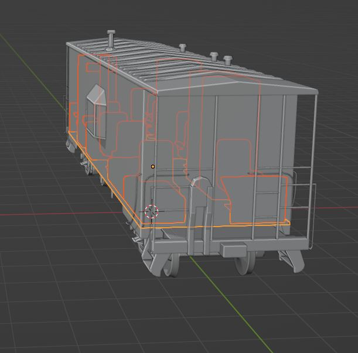

=== Making Rolling Stock - Project #3

Starting of this section with some tips related to creating rolling stock.

Remember these tips?

* Rolling stock is typically symmetrical so making use of the `Mirror` modifier to create the opposite side of a shape is a timesaver
* Consider "MARKING SEAMS" while you are modeling instead of saving it until you are ready to UV map your textures.
* Recycle as much as possible from existing models (Bogies, Couplers, Coupler Lift Bars, etc) Hint: Create a collection of re-usable parts.

Let's Say we are was making a simple flatcar.  Nothing too complicated.

==== Using Background Images

As with the previous project, we load in our reference background images.  I picked a random image from the internet using a Google search because... Why not?

==== Starting from the ground up

I like to start constructing vehicles starting with the trucks, and for this I’m going to recommend downloading a *.blend file to simplify this.   Erick Cantu has graciously provided various trucks that we can include in our own models.  They can be downloaded from Elvas Tower.

You really should not need to make your own truck and coupler models.  These are pretty standardized objects with a minimal number of variations.  Chances are good that you can find available models to import instead of making them yourself.  In the long runm this will lead to consistency between modelers.

[TIP]
I have also uploaded a usable Blender example of 100T truck, based on Erick's there as well.  Available items include: "Source files for NAVS N-Series freight car trucks", "Source files for NAVS Z-Series freight car trucks", "100T Roller Bearing Truck Blender Object" some of which are also available at Trainsim.com as well.    Erick's trucks include attached couplers. I often choose to separate the couplers but that is left up to you to decide.  Erick has good reasons for keeping couplers attached to truck rotations.

Using these existing objects, we can Append the ready-to-use model into our initial blend file.

I have been able to adjust the wheel radius as needed, though it's probably not entirely prototypical to do so on the trucks provided so far.

If you feel so inclined, you could create your own wheel sets from scratch, but I leave that up to you.  Also note, since it is very likely we will be using LOD ranges with this model, understand that we will make the highest detail model first.  It is much easier to take away than add objects later.

==== Vehicle LOD - Level of Detail Settings

(((BLENDER, "Level Of Detail")))

In realtime computer graphics, a technique called "level of detail" (LOD) is commonly used in various applications ranging from commercial simulators to PC and console games.

When 3D games are running on a graphics card, there is a limit to the number of surfaces (polygons and triangles) and textures that can be drawn. If this limit is exceeded, the game or simulation starts to slow down and the movements become jerky.

If the graphics engine is asked to do too much then the program's framerate drops. This drop in framerate results in jerky movements and slower update rates, which can become very noticeable and take away from the sense of immersion.

Lets also look at an excerpt from the Open Rails Manual:

----
Many visual objects are modelled at more than one level of detail (LOD) so, when they are seen at a distance, Open Rails can switch to the lesser level of detail without compromising the view. This use of multiple LODs reduces the processing load and so may increase frame rates.
----

[TIP]
Always apply textures before defining any LOD settings.

Referring to some example snippets from the Outliner window in a Blender Working session...  Watch out for the "GOTCHA's"...

----
Scene Collection
        MAIN
              MAIN_1000
                     BodyLOD1
                           Bogie1
----

Copying a part and adding it to the collection BodyLOD2. Outliner Result...

----
Scene Collection
        MAIN
             MAIN_1000
                    BodyLOD1
                         Bogie1

        MAIN_2000
             BodyLOD2
                   Bogie1.001
----

Looking at it now, shouldn't MAIN_2000 be directly under MAIN_1000 like this

----
Scene Collection
   MAIN
         MAIN_1000
                BodyLOD1
                      Bogie1

          MAIN_2000
                  BodyLOD2
                          Bogie1.001
----

Answer:  YES, What happened is that MAIN_2000 was created at the same level MAIN not MAIN_1000.  Only what resides below the MAIN collection will be considered for EXPORT.

Let's Look at some other issues here whith what is shown above... Don't forget capitalization. 

For Example: All cases of *Bogie1* should be *BOGIE1*.

With the above example setup, the high resolution BOGIE1 part will disappear at 1000 meters. Then the low res BOGIE1.001 will take over. That low res bogie won't be animated, which is fine, since its too far away to see anyway.

Here's how to do it if you need the lower resolution bogie to be animated:

* Use an Empty for BOGIE1
* Link it to both MAIN_1000 and MAIN_2000 using drag and CTRL drop in the Outliner
* Attach the low and high resolution meshes to it in their respective LOD collections

----
Scene Collection
   MAIN
         MAIN_1000
                BodyLOD1
                BOGIE1
                    BogieLOD1

          MAIN_2000
                BodyLOD2
                BOGIE1
                    BogieLOD2

----

[TIP]
Don't forget to check out the sample locomotive file that is provided with the MSTS exporter download.

Once you copy the completed model to the Alternate LOD Collection, you can begin deleting details that won't normally be visible at longer distances.

